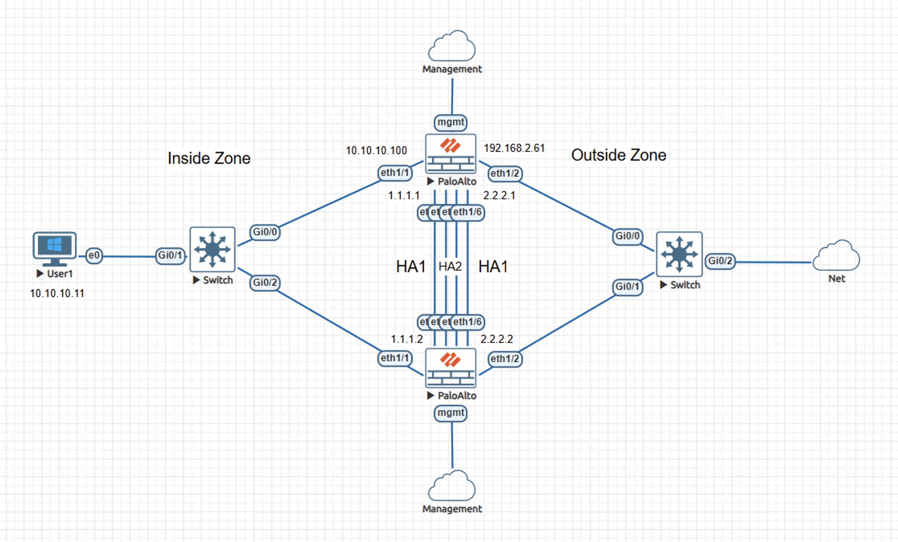
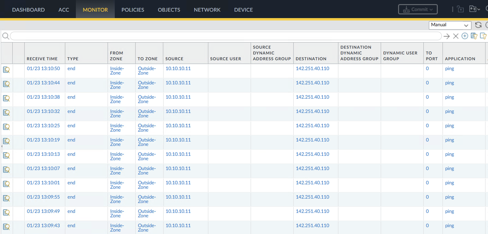
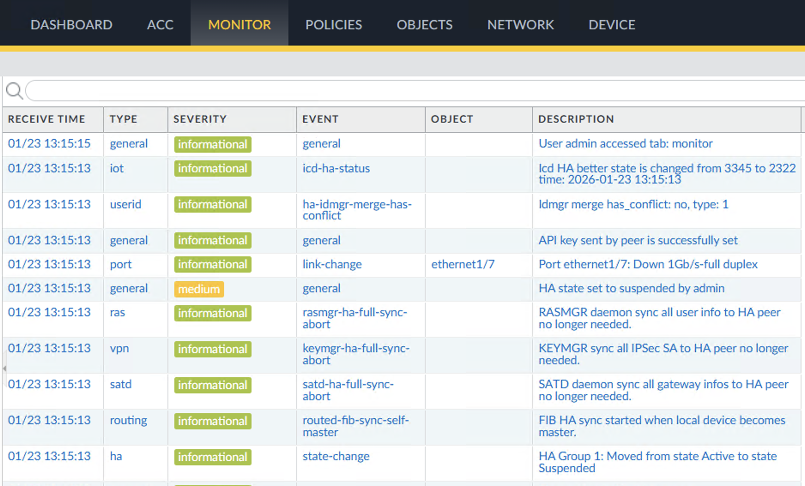
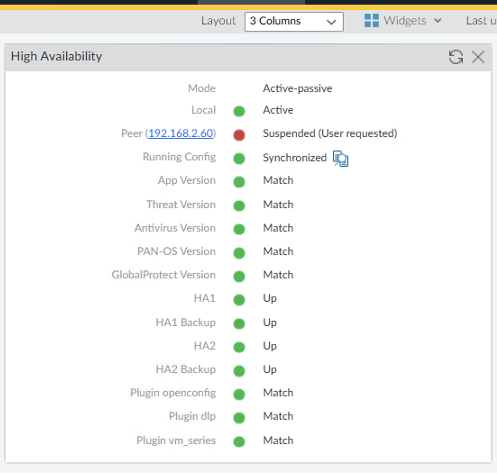

# Lab – Active/Passive HA Failover on Palo Alto NGFW

This lab demonstrates active/passive High Availability behavior on Palo Alto NGFW when a monitored interface failure triggers a role transition and traffic enforcement continues on the newly active firewall.

The content is documented as a validated engineering case note rather than a configuration walkthrough.

## Lab Objectives
- Validate HA role transition during a monitored interface failure
- Confirm continued inside-to-outside connectivity after failover
- Observe synchronization and state consistency following role change

## Topology Summary
The lab consists of two Palo Alto NGFW virtual appliances configured in an active/passive High Availability pair. Both firewalls share Layer-2 inside and outside segments and use dedicated HA1 and HA2 links for control and data synchronization, with a backup physical link configured for each. The firewalls are managed via out-of-band management interfaces. An internal host generates traffic toward an external destination through the HA pair.

## Configuration Summary
- Active/passive HA enabled with link monitoring
- Shared inside and outside interfaces
- Dedicated HA1 and HA2 connections
- Out-of-band management access

(Configuration details intentionally omitted; focus is on behavior and validation.)

## Validation and Results

### Proof of Operational Behavior
- Traffic logs showed consistent inside-to-outside ICMP traffic prior to the failure event
- System logs recorded the monitored interface going down and the active firewall entering a suspended state
- HA status confirmed promotion of the peer firewall to the active role with synchronized configuration
- Traffic logs confirmed continued policy enforcement and connectivity after failover

Primary evidence includes system logs, HA status indicators, and traffic logs demonstrating uninterrupted reachability.

## Key Takeaways
- Active/passive HA enables continued traffic enforcement during interface-level failures
- Monitored interfaces provide deterministic failover triggers
- Proper HA synchronization reduces operational disruption during active firewall changes

## Lab Environment
- Palo Alto NGFW (VM-Series)
- Cisco switching for Layer-2 connectivity
- EVE-NG lab environment

## Status
Validated and complete.
