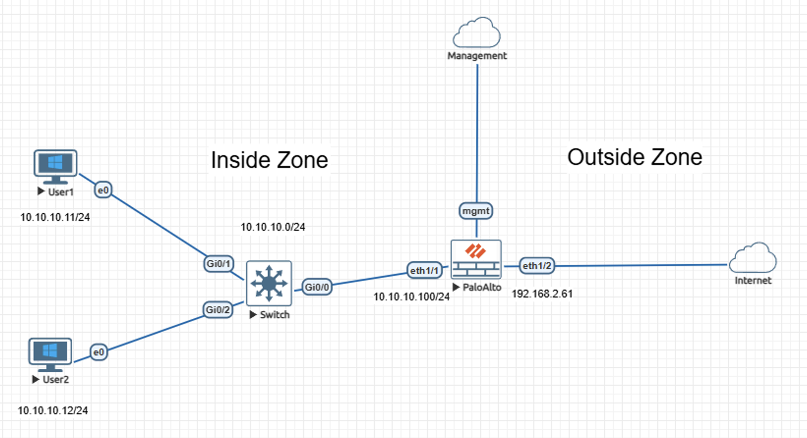
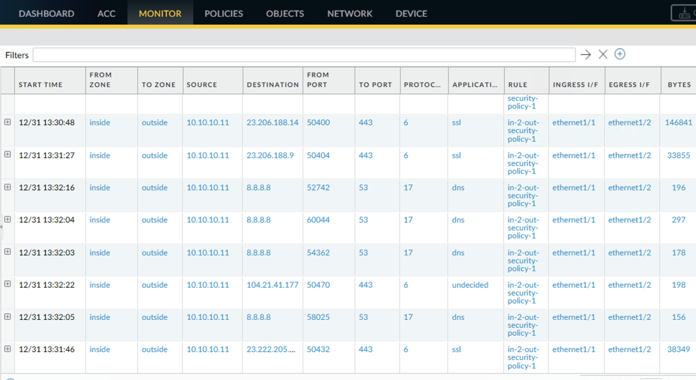
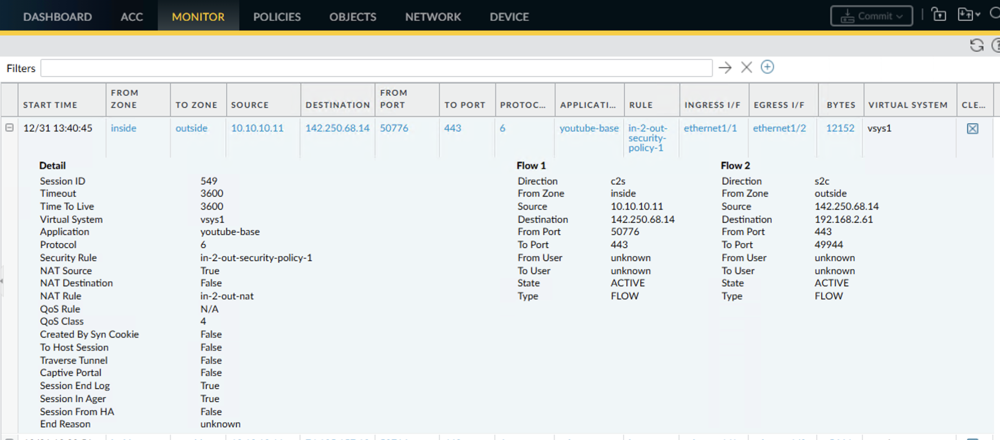

# Lab – Application-Based Internet Access Enforcement on Palo Alto NGFW

## Overview
Unrestricted outbound Internet access presents risk when application usage is not explicitly constrained. This lab validates application-based outbound access control using Palo Alto NGFW App-ID, demonstrating YouTube-only Internet access enforcement for a specific internal host.

This lab is documented as a validated engineering case note rather than a configuration walkthrough.

## Lab Objectives
- Demonstrate baseline unrestricted outbound Internet behavior
- Confirm source NAT functionality for inside-to-outside traffic
- Enforce application-specific outbound access for a single internal host
- Verify application-level enforcement using firewall behavioral evidence

## Topology Summary
The topology consists of two internal hosts connected via a Layer 2 switch to a Palo Alto NGFW. The firewall separates an inside zone from an outside Internet-facing zone, with source NAT applied for outbound connectivity. A dedicated management interface is used for administrative access. One internal host is treated as a controlled participant subject to application restrictions.

## Configuration Summary
- Security zoning separating inside and outside trust boundaries
- Source NAT for outbound Internet access
- Baseline security policy permitting outbound connectivity
- Application-based security policy enforcing YouTube-only access

(Configuration details intentionally omitted; focus is on behavior and validation.)

## Validation and Results

### Behavior Without the Control
Prior to application enforcement, the internal host generated multiple concurrent outbound sessions across different applications, including SSL and DNS. Traffic logs confirm unrestricted Internet access with successful NAT translation.

### Behavior With the Control
After enforcement, the only permitted outbound sessions observed from the host were classified as YouTube (youtube-base) by App-ID. Firewall traffic logs confirm application identification and policy-based allowance of YouTube sessions.

## Key Takeaways
- Application-aware controls provide precision beyond port-based filtering
- Source NAT enables outbound connectivity without exposing internal addressing
- Behavioral validation confirms effective enforcement of security intent

## Lab Environment
- Palo Alto Networks NGFW (VM-Series)
- Cisco Layer 2 switch
- EVE-NG virtual lab platform

## Status
Validated and complete.
