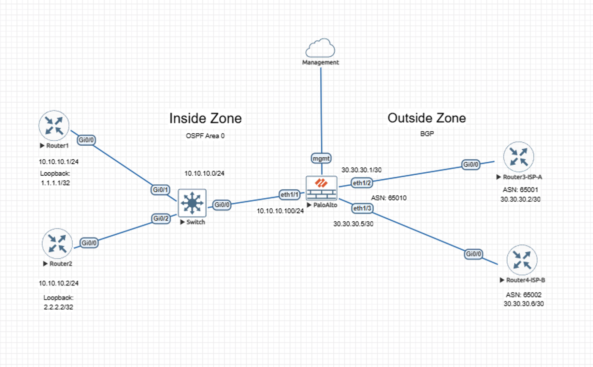

# Lab – BGP Routing on Palo Alto NGFW (Dual eBGP ISP Peers)

## Overview
This lab demonstrates BGP control-plane behavior between a Palo Alto Networks NGFW and dual upstream Cisco routing peers operating as independent ISP edges. The focus is on neighbor establishment, policy-driven path selection, failover behavior, and recovery validation within a firewall-centric routing architecture.

This lab is documented as a validated engineering case note rather than a configuration walkthrough.

## Lab Objectives
- Validate stable eBGP neighbor establishment with multiple upstream peers
- Confirm BGP-learned route installation on the Palo Alto NGFW
- Verify deterministic path selection using BGP attributes
- Observe routing behavior during upstream failure conditions
- Validate clean recovery and re-selection of the preferred path

## Topology Summary
The topology consists of a Palo Alto Networks NGFW acting as the network edge, peering via eBGP with two upstream Cisco routers representing separate ISP providers. Internal routing is handled within an OSPF Area 0 domain on the inside zone, while external reachability is controlled through BGP on the outside zone.

The firewall participates directly in routing decisions while enforcing security and zone boundaries between internal and external domains.

## Validation Summary
The lab is considered validated based on the following observed outcomes:

- Dual eBGP neighbors establish successfully and maintain stable session uptime
- Multiple default routes (`0.0.0.0/0`) are learned from independent upstream peers
- Path selection is deterministic and driven by BGP attributes (local preference)
- When the preferred upstream peer becomes unavailable, routing reconverges to the secondary ISP
- Upon restoration of the preferred peer, the firewall cleanly reselects the original best path

## Validation Artifacts
- **Validation-1:** eBGP neighbor status confirming both ISP peers in Established state
- **Validation-2:** Local RIB showing dual default routes with policy-based preference
- **Validation-3:** Failover state demonstrating withdrawal of the preferred path and use of the backup ISP
- **Validation-4:** Recovery state confirming restoration and re-selection of the preferred path

## Notes
- Configuration details are intentionally omitted.
- This lab emphasizes observable routing behavior and validated outcomes rather than implementation steps.
- Validation is derived from control-plane state and routing table behavior on the Palo Alto NGFW.
