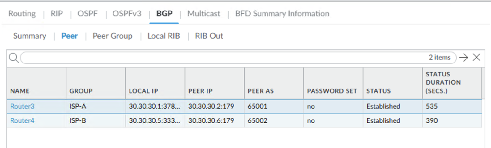
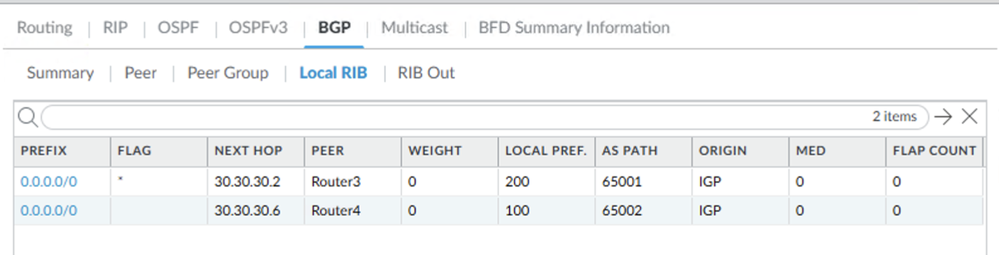
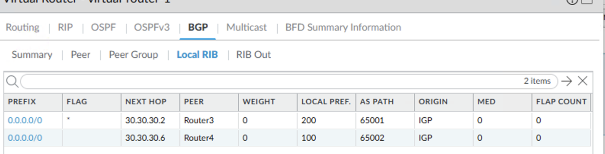

# Lab – BGP Routing on Palo Alto NGFW (Dual eBGP ISP Peers)

## Overview
This lab demonstrates BGP control-plane behavior and routing outcomes on a Palo Alto Networks NGFW peering with dual upstream ISP routers. The focus is on deterministic path selection, failover behavior, and recovery based on BGP attributes and observed routing state.

This lab is documented as a validated engineering case note rather than a configuration walkthrough.

## Lab Objectives
- Validate stable eBGP neighbor establishment with multiple upstream peers
- Confirm installation of BGP-learned default routes on the firewall
- Verify deterministic path selection using BGP attributes
- Observe routing behavior during upstream failure
- Confirm clean recovery and re-selection of the preferred path

## Topology Summary
The topology consists of a Palo Alto Networks NGFW acting as the network edge, peering via eBGP with two upstream Cisco routers representing independent ISPs. Internal routing operates within an OSPF Area 0 domain on the trusted side of the firewall, while external connectivity is governed by BGP on the untrusted side.

## Configuration Summary
- BGP enabled on the Palo Alto NGFW virtual router
- eBGP peering established with two upstream ISP routers
- Policy-based BGP attributes applied to influence path selection
- Default routes learned dynamically from upstream peers

(Configuration details intentionally omitted; focus is on behavior and validation.)

## Validation and Results
This lab was validated by observing control-plane state and routing behavior under normal operation, failure, and recovery conditions.

- **Correct Operational State**
  - Both upstream eBGP neighbors reach and maintain Established state
  - The firewall receives default routes from independent peers

- **Path Selection and Next-Hop Resolution**
  - Multiple default routes are present in the routing table
  - BGP attributes determine the preferred outbound path

- **Stability and Failover**
  - Loss of the preferred upstream peer results in withdrawal of the primary route
  - Traffic reconverges to the secondary ISP without instability

- **Recovery**
  - Restoration of the preferred peer results in reinstallation of the primary route
  - The firewall returns to the original steady-state routing behavior

## Key Takeaways
- BGP attributes provide deterministic outbound path control on a firewall edge
- Dual ISP design improves resilience during upstream failures
- Observable routing behavior confirms stable failover and recovery

## Lab Environment
- Palo Alto Networks NGFW (VM-Series)
- Cisco IOS routers (ISP peers)
- EVE-NG virtual lab platform

## Status
Validated and complete.
