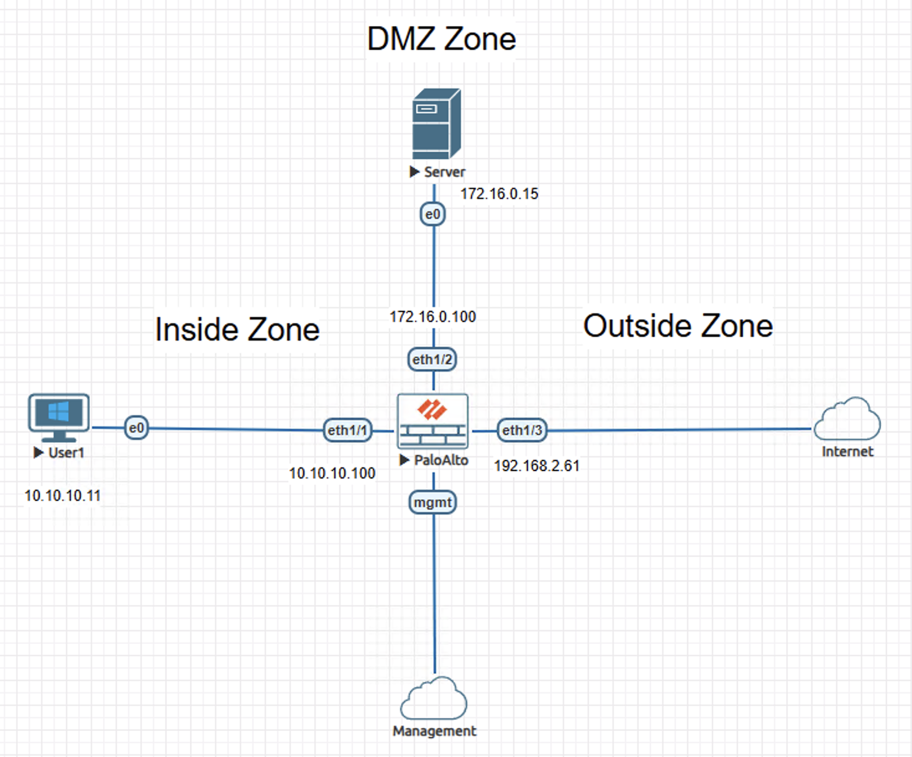
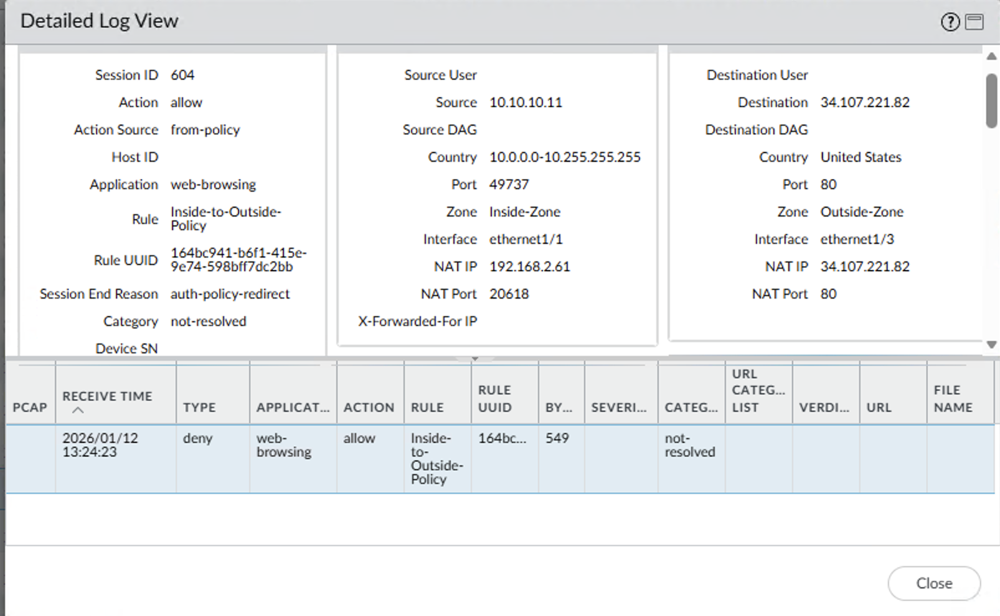
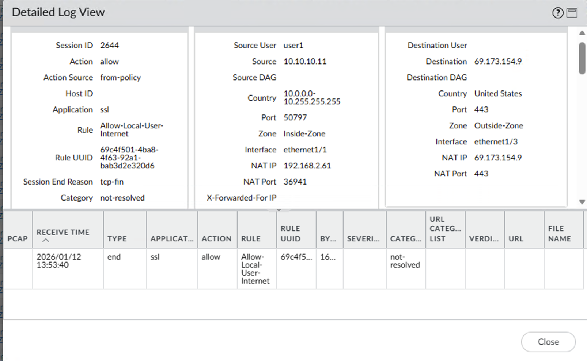

# Lab – Captive Portal User-ID Enforcement on Palo Alto NGFW

## Overview
This lab demonstrates identity-aware outbound access enforcement using Palo Alto NGFW Captive Portal and local user authentication.

The content is documented as a validated engineering case note rather than a configuration walkthrough.

## Lab Objectives
- Validate Captive Portal redirection for unauthenticated outbound traffic
- Observe traffic behavior without resolved user identity
- Confirm user identity association after authentication
- Verify enforcement of a user-based security policy

## Topology Summary
An inside-zone client initiates outbound internet traffic through a Palo Alto NGFW. A Captive Portal is enabled on the inside zone, requiring user authentication before allowing identity-based access. The firewall enforces different security policies before and after user authentication, while the outside zone represents the public internet.

## Configuration Summary
- Captive Portal enabled with a local authentication source
- Generic inside-to-outside baseline security policy
- User-based outbound security policy positioned above baseline

(Configuration details intentionally omitted; focus is on behavior and validation.)

## Validation and Results

### Behavior Without the Control
Prior to authentication, outbound web traffic from the inside client was evaluated without a resolved user identity and matched a generic inside-to-outside security policy, resulting in redirection for Captive Portal authentication, as indicated by the auth-policy-redirect session end reason in traffic logs.

### Behavior With the Control
After successful authentication, outbound traffic was associated with a resolved local user identity (user1). The same traffic was evaluated against a user-based security policy and allowed to complete normally, with session termination occurring via TCP FIN.

## Key Takeaways
- Identity-based enforcement prevents unauthenticated access from bypassing security controls
- Captive Portal ensures user attribution before outbound access is permitted
- User-ID integration improves policy precision and reduces unauthorized exposure

## Lab Environment
- Palo Alto NGFW (VM-Series)
- Inside client workstation
- Internet-facing outside network
- EVE-NG

## Status
Validated and complete.
