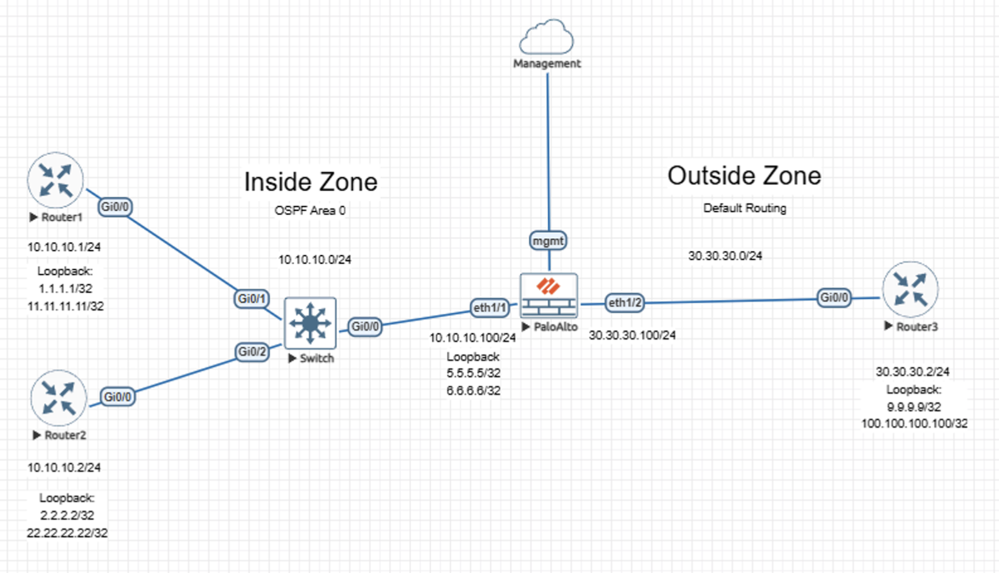
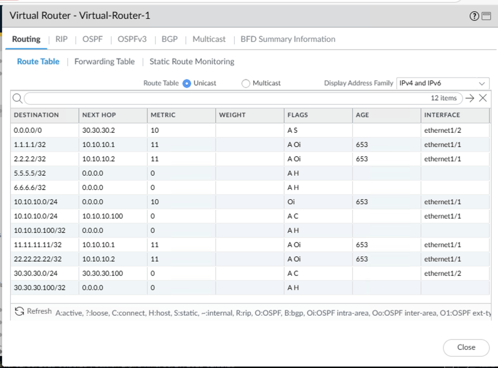
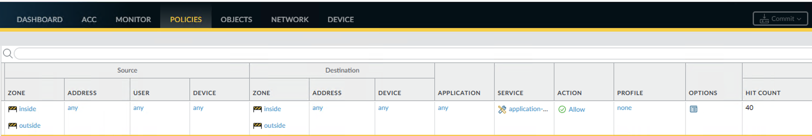

# Lab – Default Routing, Route Redistribution, and Inter-Zone Policy Enforcement

## Overview
This lab demonstrates how a Palo Alto Networks NGFW handles default routing and route redistribution while enforcing explicit inter-zone security policy between trusted and untrusted network segments. The focus is on observable routing state and policy-governed traffic behavior across zone boundaries. 

This lab is documented as a validated engineering case note rather than a configuration walkthrough.

## Lab Objectives
- Confirm installation and use of a default route on the NGFW
- Verify redistribution of routing information between OSPF and static routes
- Validate correct next-hop resolution for inside and outside networks
- Demonstrate intentional inter-zone traffic enforcement through security policy

## Topology Summary
The topology consists of multiple Cisco routers participating in OSPF within an Inside zone, a Palo Alto Networks NGFW acting as the routing and security boundary, and an Outside zone using default routing. The firewall separates trust zones and governs traffic flow between them through explicit policy.

## Configuration Summary
- Virtual router configuration supporting OSPF and static default routing
- Route redistribution between OSPF-learned networks and the default route
- Zone-based interface assignment for Inside and Outside segments
- Explicit inter-zone security policy permitting controlled traffic flow

(Configuration details intentionally omitted; focus is on behavior and validation.)

## Validation and Results

### Proof of Correct Operational State
- The NGFW routing table shows a valid default route pointing toward the Outside zone
- OSPF-learned routes from Inside zone routers are present and stable
- Connected and host routes are correctly installed on relevant interfaces
- Next-hop resolution aligns with expected zone boundaries

### Proof of Policy-Governed Traffic Behavior
- Bidirectional traffic between Inside and Outside networks was generated
- Traffic matched an explicit inter-zone security rule
- Policy hit counts incremented, confirming active enforcement
- Traffic flow occurred only through defined security policy, not implicit routing behavior

## Key Takeaways
- Default routing and redistribution expand reachability but do not bypass security enforcement
- Inter-zone communication remains explicitly controlled by firewall policy
- Observable routing state and policy hit counts provide defensible validation evidence

## Lab Environment
- Palo Alto Networks NGFW (VM-Series)
- Cisco routers
- EVE-NG virtual lab platform

## Status
Validated and complete.
