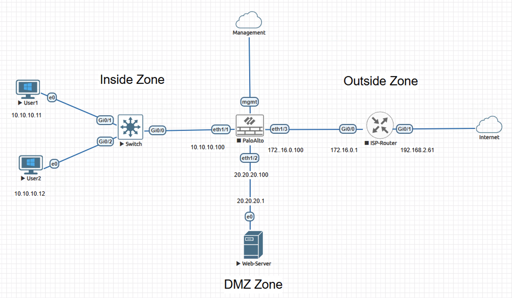
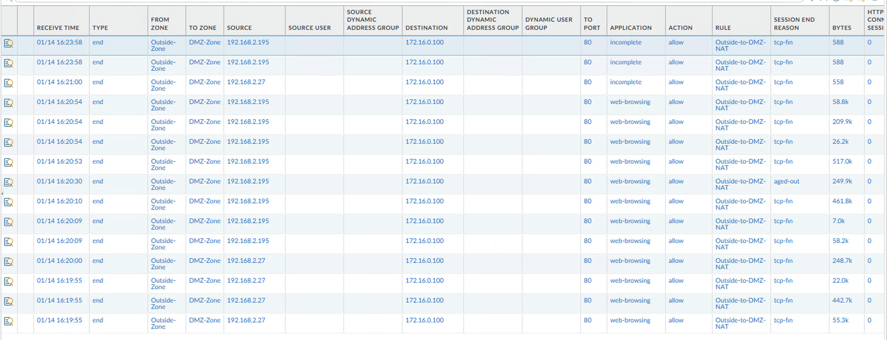
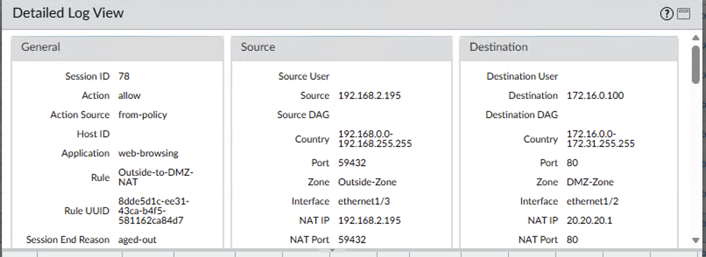

# Lab – Destination NAT with Pre-NAT Security Policy Matching on Palo Alto NGFW

## Overview
This lab demonstrates destination NAT behavior on a Palo Alto NGFW, specifically validating that inbound security policy evaluation occurs against the original pre-NAT destination address before address translation is applied.

The content is documented as a validated engineering case note rather than a configuration walkthrough.

## Lab Objectives
- Validate security policy enforcement using the original destination IP
- Confirm destination NAT translation occurs post-policy evaluation
- Observe session state reflecting translated DMZ server address
- Correlate traffic logs and session details for behavioral confirmation

## Topology Summary
The environment consists of an internal user segment, a DMZ hosting a web server, and an external network simulating internet-based clients. Trust boundaries are enforced by a Palo Alto NGFW positioned between inside, DMZ, and outside zones, with inbound traffic originating from an untrusted external segment.

## Configuration Summary
- Destination NAT rule translating a public-facing IP to an internal DMZ web server
- Inbound security policy explicitly referencing the pre-NAT destination address
- HTTP service exposure limited to the DMZ zone

(Configuration details intentionally omitted; focus is on behavior and validation.)

## Validation and Results

### Behavior Without the Control
Without destination NAT, inbound traffic to the public-facing address would not reach the DMZ web server, preventing service accessibility.

### Behavior With the Control
With destination NAT applied, inbound HTTP traffic is permitted by security policy using the original destination IP and subsequently translated to the DMZ server address during session establishment.

Traffic logs in validation-1.png demonstrate multiple sessions originating from the Outside-Zone (192.168.2.x) matching the Outside-to-DMZ-NAT security rule with destination address 172.16.0.100, confirming pre-NAT policy evaluation.

The detailed session view in validation-2.png confirms destination NAT translation to 20.20.20.1 (DMZ web server) occurred after policy enforcement, evidenced by distinct destination and NAT IP fields within the same session.

## Key Takeaways
- Palo Alto NGFW evaluates inbound security policy using the original destination address prior to NAT.
- Destination NAT is applied only after policy enforcement during session establishment.
- Clear separation of policy enforcement (pre-NAT) and address translation (post-policy) improves operational predictability and reduces the attack surface by ensuring inbound traffic is evaluated against published service addresses rather than internal topology.

## Lab Environment
- Palo Alto NGFW
- Cisco router
- Cisco switch
- Client workstation
- EVE-NG lab environment

## Status
Validated and complete.
