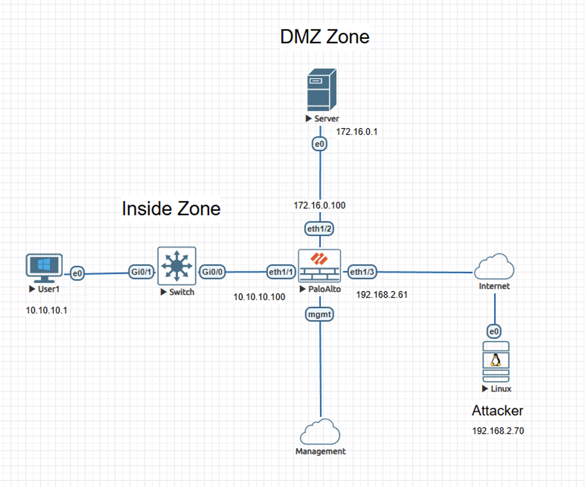
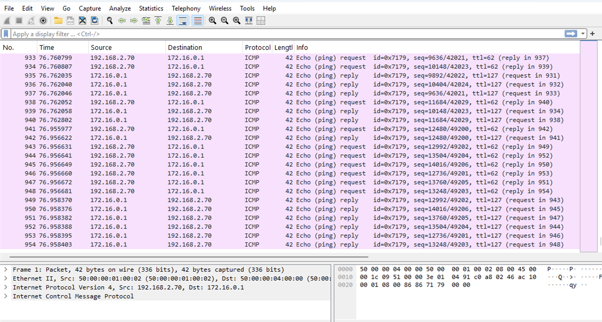
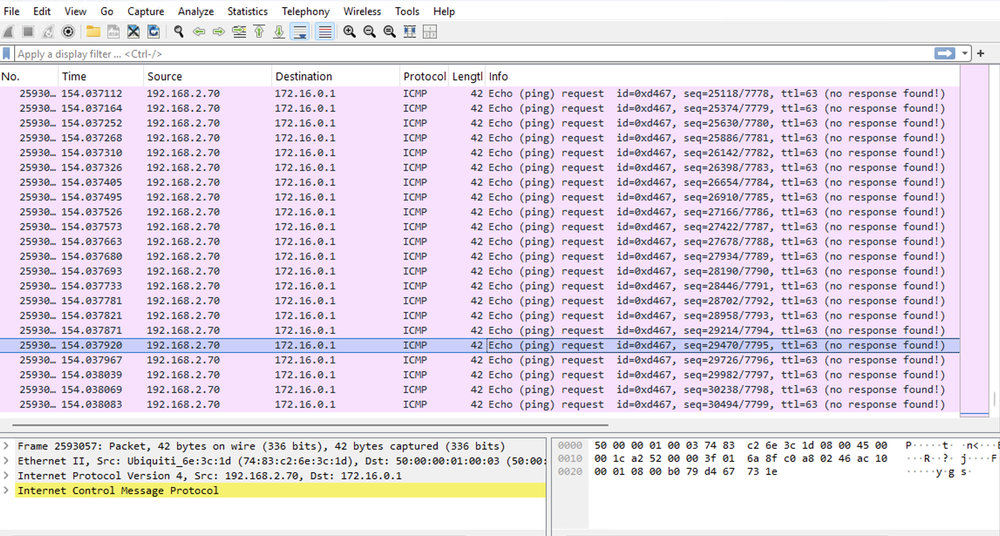
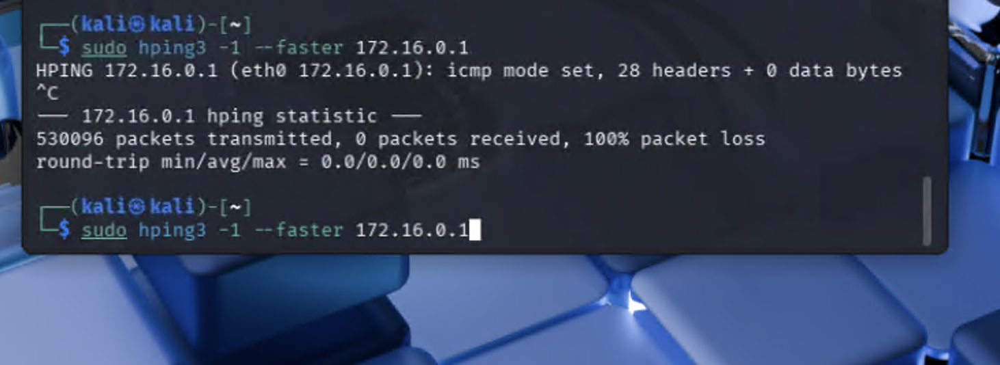

# Lab – DoS Protection on Palo Alto NGFW

## Overview
This lab demonstrates how Palo Alto NGFW DoS Protection enforces traffic handling during an active attack condition targeting a DMZ-hosted service. An ICMP flood is used as an observable condition, with enforcement behavior assessed using firewall dataplane packet capture. 

This lab is documented as a validated engineering case note rather than a configuration walkthrough.

## Lab Objectives
- Observe baseline ICMP traffic behavior prior to DoS enforcement
- Confirm DoS Protection enforcement behavior during sustained attack conditions
- Verify changes in traffic handling using packet-level evidence
- Demonstrate loss of attacker reachability once enforcement occurs

## Topology Summary
The environment consists of an internal network, a DMZ-hosted server, and an external attacker network. A Palo Alto NGFW protects the DMZ service from untrusted traffic. An unauthorized external host generates high-rate ICMP traffic toward the DMZ-exposed service through the public-facing interface.

## Configuration Summary
- DoS Protection policies applied to traffic destined for the DMZ service

(Configuration details intentionally omitted; focus is on behavior and validation.)

## Validation and Results

### Behavior Without the Control
Firewall dataplane packet capture shows ICMP echo requests from the attacker reaching the DMZ server with corresponding echo replies transmitted back through the firewall, indicating unrestricted baseline behavior.

### Behavior With the Control
After DoS Protection enforcement engages, dataplane packet capture shows ICMP echo requests arriving at the firewall without corresponding replies being transmitted. The attacker host records complete packet loss, confirming DoS Protection enforcement under sustained attack conditions.

## Key Takeaways
- DoS Protection enforces rate-based controls during active attack conditions
- Enforcement behavior is observable directly at the firewall dataplane
- Packet-level evidence provides authoritative confirmation of mitigation

## Lab Environment
- Palo Alto Networks NGFW (VM-Series)
- Cisco routing and switching devices
- Linux-based attacker and server hosts
- EVE-NG virtual lab platform

## Status
Validated and complete.
