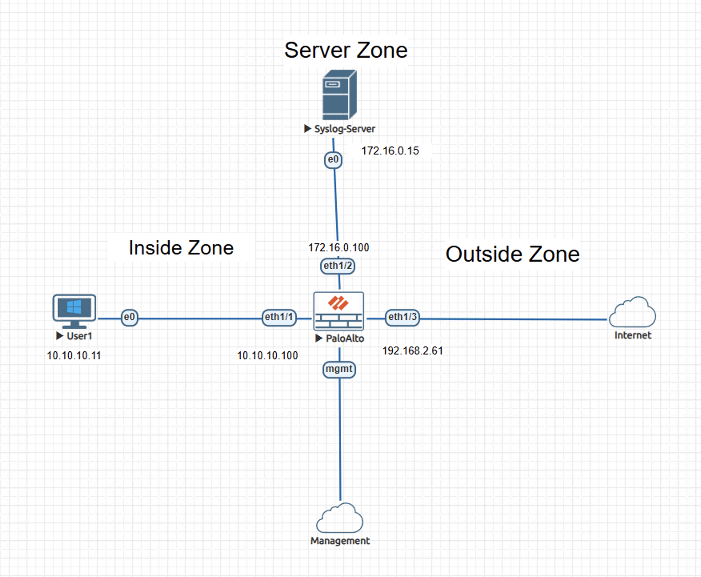
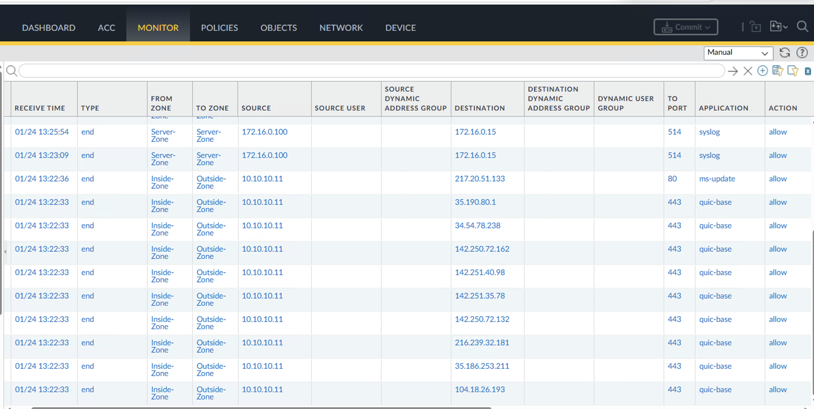
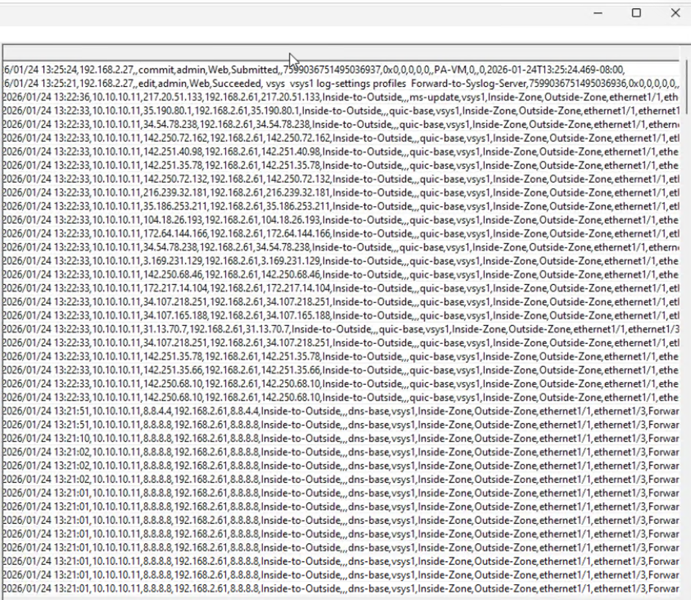

# Lab – External Syslog Log Forwarding on Palo Alto NGFW

## Overview
This lab demonstrates how a Palo Alto NGFW generates traffic and system logs and forwards them to an external syslog server using log forwarding profiles and explicit service routing.

The content is documented as a validated engineering case note rather than a configuration walkthrough.

## Lab Objectives
- Verify generation of traffic, system, and configuration logs on the NGFW
- Validate forwarding of logs to an external syslog server
- Confirm log integrity and session detail consistency across systems
- Observe real-time delivery of operational log data

## Topology Summary
The environment consists of a Palo Alto NGFW deployed between an inside user network and an outside internet segment, with a dedicated server zone hosting an external syslog server. Trust boundaries are enforced by security zones, and management access is isolated from data-plane traffic.

## Configuration Summary
- Syslog Server Profile defined and applied
- Log Forwarding Profile attached to active traffic policies
- Logging enabled for traffic, system, configuration, and URL log types
- Service routing configured for syslog delivery

(Configuration details intentionally omitted; focus is on behavior and validation.)

## Validation and Results

### Proof of Operational Behavior
- User-initiated traffic generated active sessions through the NGFW
- Corresponding traffic logs reflected security policy enforcement and NAT translation
- System and configuration events produced local log entries
- External syslog server received structured log messages containing session identifiers, security policy references, NAT information, and system event details consistent with locally generated logs
- Log timestamps and session metadata aligned across the NGFW and the external syslog server

Primary evidence consists of NGFW traffic logs and corresponding external syslog entries showing aligned timestamps, source and translated IP addresses, security policy identifiers, and session metadata for active user traffic.

## Key Takeaways
- External syslog forwarding ensures security and operational logs persist beyond the firewall and remain available for investigation and review.
- Forwarded logs preserve both original and translated IP information, supporting accurate session tracing across network boundaries.
- Centralized log collection enables consistent correlation of firewall activity with external monitoring and analysis systems.

## Lab Environment
- Palo Alto NGFW (VM-Series)
- External syslog server
- EVE-NG

## Status
Validated and complete.
