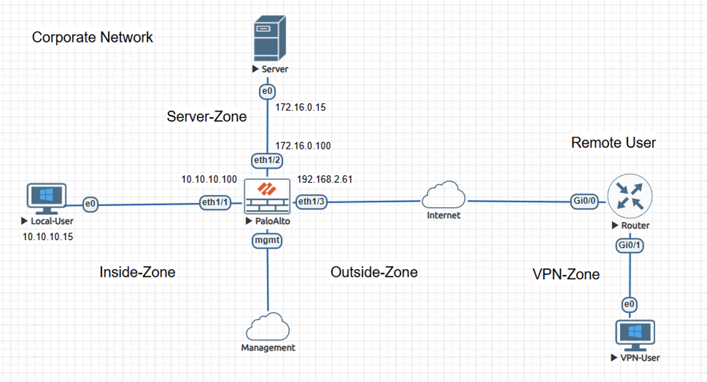
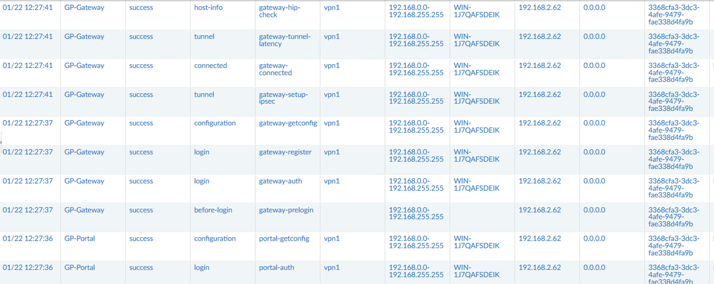
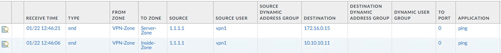
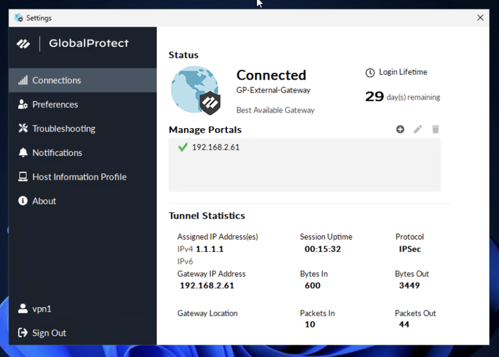

# Lab – GlobalProtect Remote Access VPN on Palo Alto NGFW

This lab demonstrates a GlobalProtect remote user authenticating, establishing an encrypted tunnel, and sending traffic into a dedicated VPN security zone where access to internal networks is enforced by inter-zone security policy.

The content is documented as a validated engineering case note rather than a configuration walkthrough.

## Lab Objectives
- Establish a secure GlobalProtect remote access tunnel
- Terminate remote user traffic into a dedicated VPN security zone
- Enforce explicit inter-zone security policy for internal access
- Verify observable behavior through logs and client status

## Topology Summary
The environment consists of a Palo Alto NGFW with Inside, Server, Outside, and VPN security zones. A remote user connects over the Internet using GlobalProtect, receiving an assigned VPN IP address and accessing internal resources only through explicitly permitted inter-zone security policies.

## Configuration Summary
- GlobalProtect portal and gateway configured on the Palo Alto NGFW
- VPN security zone defined for remote access termination
- Security policies permitting VPN-zone access to Inside and Server zones

(Configuration details intentionally omitted; focus is on behavior and validation.)

## Validation and Results
### Proof of Operational State
- GlobalProtect logs confirm successful portal authentication and gateway registration
- IPsec tunnel establishment verified through gateway logs and client status
- Firewall traffic logs show VPN-zone traffic matching explicit security policies when accessing internal networks

## Key Takeaways
- Remote access traffic is explicitly enforced through zone-based security policy
- Dedicated VPN zones reduce unintended access paths into internal networks
- Observable validation confirms secure and controlled remote connectivity

## Lab Environment
- Palo Alto NGFW (VM-Series)
- Cisco Router
- Client workstations
- EVE-NG lab environment

## Status
Validated and complete.
