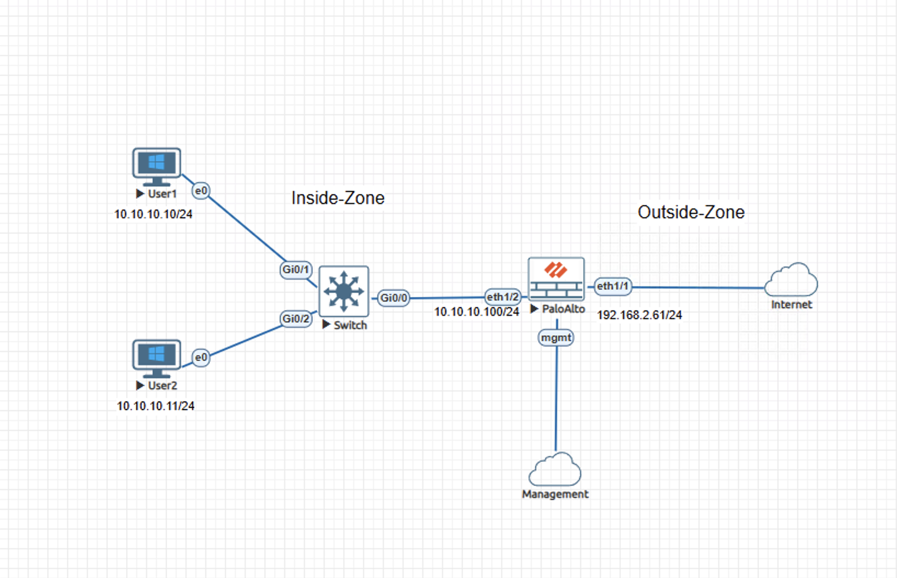
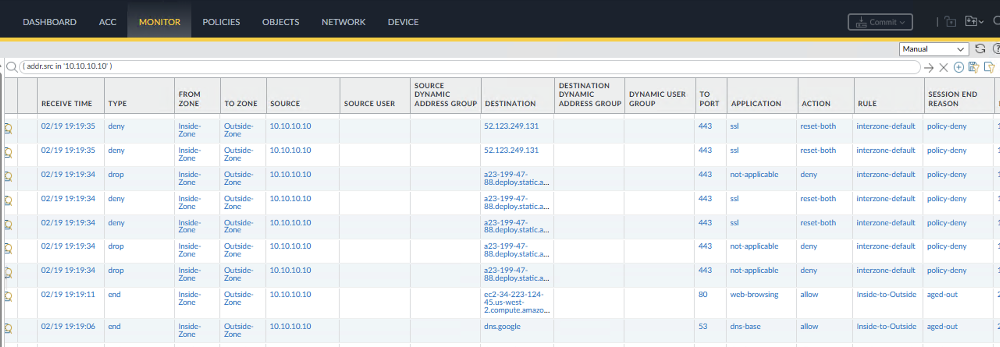
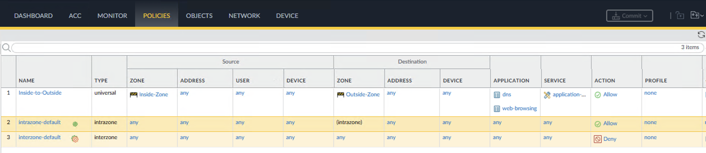
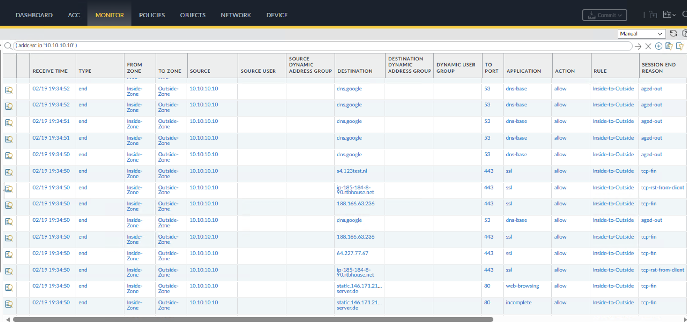

# Incident Case Study - Application-Based Policy Mismatch on Palo Alto NGFW

## Overview

This case study reproduces an incident where users reported inconsistent website accessibility. Some sites loaded successfully while others failed over HTTPS. Encrypted web sessions were denied even though routing, NAT, and outbound traffic identified as web-browsing were functioning normally.

The content is documented as a validated engineering case note rather than a configuration walkthrough.

## Impact

Users in the Inside-Zone experienced encrypted traffic failure.
HTTPS sessions on TCP 443 were denied while other outbound traffic succeeded, creating operational ambiguity and increasing troubleshooting complexity.

## Symptoms Observed

- Outbound HTTPS sessions consistently failed while other traffic succeeded
- Traffic logs recorded ssl on port 443 with action reset-both
- Sessions were processed by the interzone-default rule
- Session termination reason recorded as policy-deny
- DNS resolution traffic identified as dns-base was permitted
- Traffic classified as web-browsing was allowed by the Inside-to-Outside rule
- Successful outbound sessions confirmed routing and NAT functionality

## Investigation Process

1. Reproduced the failures from an internal host.
2. Correlated browser errors to ssl sessions on port 443.
3. Confirmed those sessions matched interzone-default with action deny.
4. Validated routing and NAT functionality through successful outbound sessions.
5. Reviewed the Inside-to-Outside security rule.
6. Verified ssl was not included in the allowed applications.

## Root Cause

The Inside-to-Outside security policy allowed dns and web-browsing but excluded ssl, causing HTTPS sessions to match the default interzone deny rule.

## Resolution

Modified the Inside-to-Outside security rule to include ssl and quic applications and committed the configuration.

## Validation After Fix

- Traffic logs show application ssl on port 443 with action allow.
- Rule match Inside-to-Outside.
- Session end reasons indicate normal TCP closure such as tcp-fin or tcp-rst-from-client.
- HTTPS websites load successfully without reset behavior.

## Engineering Lessons

- This pattern commonly occurs during transitions from port-based to App-ID–based policy design or security hardening efforts, where required applications are not explicitly included and legitimate traffic is denied by default policy.
- Application-default enforces port compliance but does not implicitly permit related applications.
- Policy intent should be validated against observed application behavior rather than assumed protocol relationships.
- Monitoring default-rule deny logs for legitimate application traffic provides an early indicator of outbound policy design gaps.

## Lab Environment

- Palo Alto NGFW
- Cisco switch
- Client workstations
- EVE-NG lab environment

## Status

Validated and complete.
