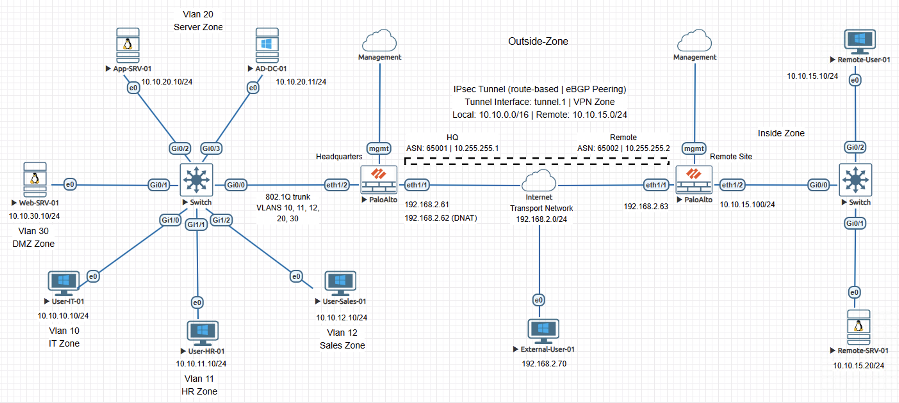
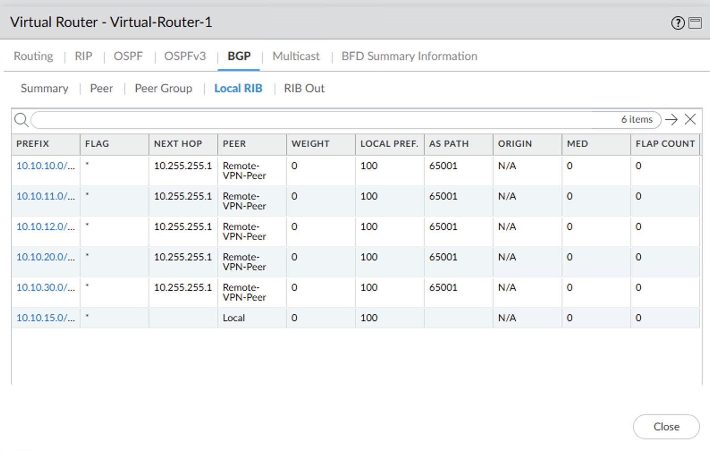
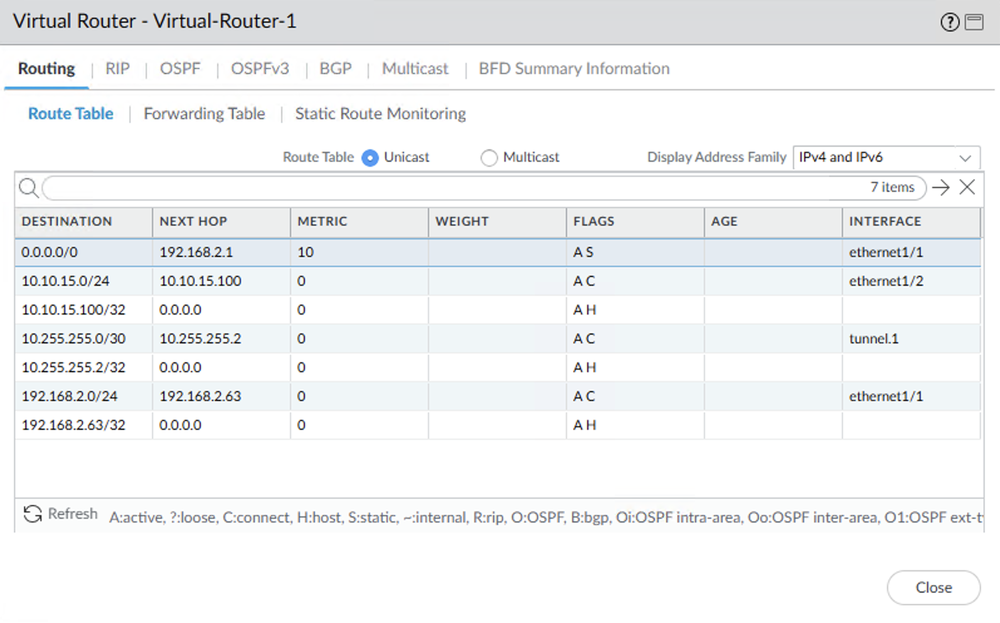
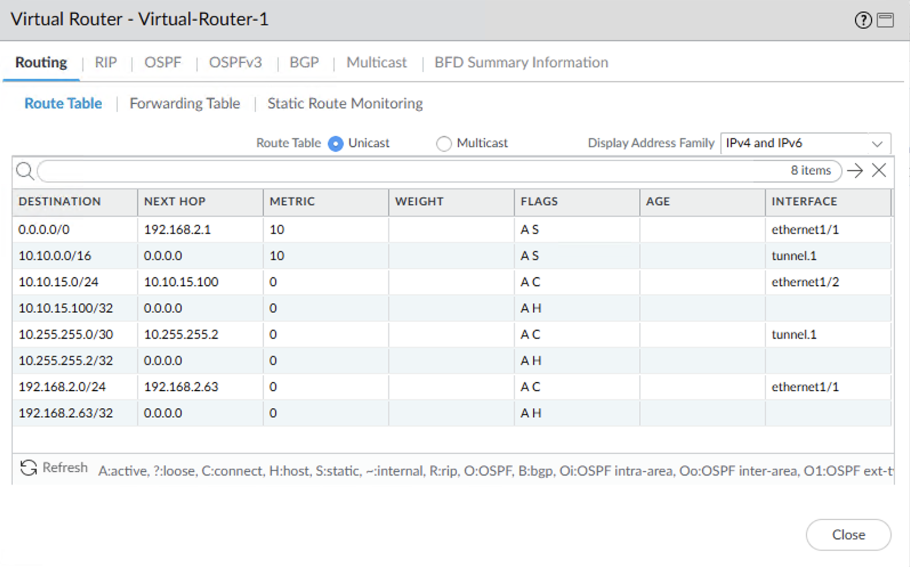

# Incident Case Study - BGP Return Path Blackhole on Palo Alto NGFW

## Overview

This case study reproduces an incident where communication between a headquarters network and a remote site across an IPsec VPN tunnel stopped functioning. Traffic from the headquarters network entered the tunnel, but the remote site did not respond to requests.

The content is documented as a validated engineering case note rather than a configuration walkthrough.

## Impact

Site-to-site connectivity across the VPN tunnel was unavailable. All traffic flows between the headquarters network and the remote site were affected, preventing access to resources on both sides of the tunnel.

## Symptoms Observed

- ICMP connectivity tests from the headquarters workstation to the remote server resulted in complete packet loss
- The headquarters firewall traffic log showed the session allowed and forwarded into the VPN tunnel interface
- The remote firewall received the ICMP request through the VPN tunnel
- The remote server remained unreachable despite the VPN tunnel and BGP session being established

## Investigation Process

1. Reviewed the headquarters firewall traffic logs to confirm the ICMP session was permitted and forwarded into the VPN tunnel interface.
2. Verified the remote firewall received the ICMP request through the tunnel.
3. Examined the BGP session and Local RIB. The session remained established and all headquarters /24 prefixes were present.
4. Compared the BGP Local RIB with the active routing table. The headquarters prefixes were absent from the routing table, leaving the default route as the only forwarding path toward the outside interface.

## Root Cause

The remote firewall previously used a static summary route to direct return traffic for the headquarters networks through the VPN tunnel. When that route was removed, the firewall no longer had an installed route for those networks.

Although BGP continued receiving the individual /24 prefixes, those routes were not installed in the active routing table. Without the summary route resolving the forwarding path toward the VPN tunnel, return traffic followed the default route toward the outside interface.

## Resolution

The static summary route directing headquarters networks toward the VPN tunnel interface was restored on the remote firewall virtual router. This change reintroduced the forwarding path required for return traffic destined for the headquarters subnets. With the route in place, the remote firewall could resolve those networks through the VPN tunnel, restoring symmetric routing across the tunnel.

## Validation After Fix

The remote firewall routing table showed the headquarters summary route active via the VPN tunnel interface. Connectivity tests from the headquarters workstation to the remote server succeeded, and firewall traffic logs showed successful session completion across the VPN tunnel.

## Engineering Lessons

- Static summary routes used as VPN return paths can hide routing dependencies until the summary route is removed.
- This situation commonly occurs during maintenance or routing cleanup when a static summary route used for VPN return traffic is removed under the assumption that BGP-learned routes will handle forwarding.
- In these environments, BGP may still advertise the individual networks behind the tunnel, making the routing environment appear healthy.
- Prefixes visible in the BGP table are not necessarily installed as active routes in the routing table used for packet forwarding.

## Lab Environment

- Palo Alto NGFWs
- Cisco switches
- Servers
- Client workstations
- EVE-NG lab environment

## Status

Validated and complete.
