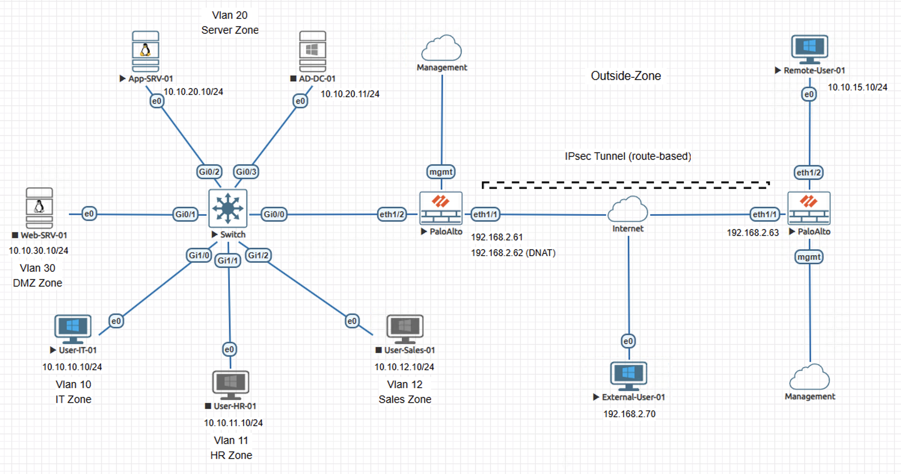
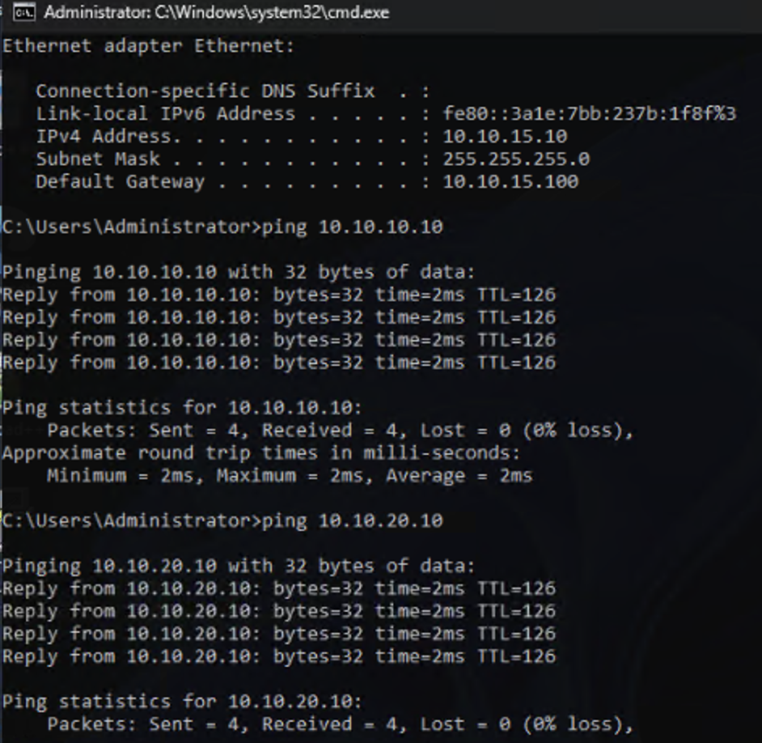
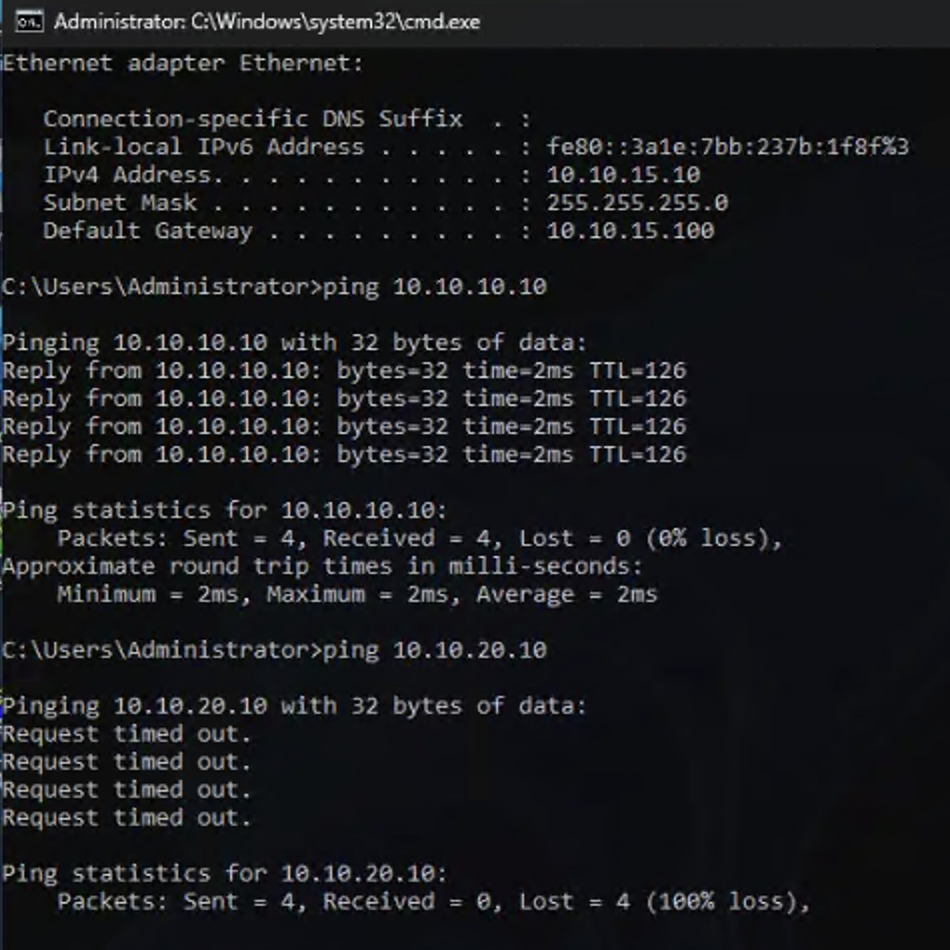
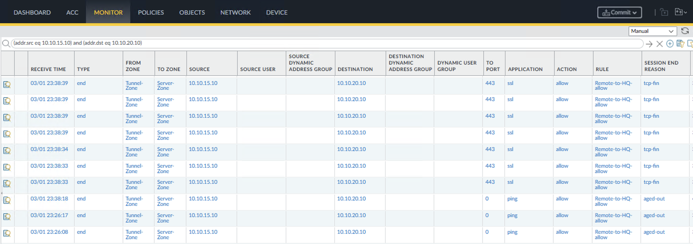

# Incident Case Study - IPsec Tunnel Selective Failure on Palo Alto NGFW

## Overview

This case study reproduces an incident where traffic from a remote subnet successfully reached one internal zone while failing to reach a second zone across the same IPsec tunnel. The failure created a partial outage condition despite IKE and IPsec phases remaining established and routing and policy appearing correct.

The content is documented as a validated engineering case note rather than a configuration walkthrough.

## Impact

Remote users were able to access the IT zone but could not reach server infrastructure in the Server zone. Application access to server hosted services was disrupted while VPN status indicators remained operational.

## Symptoms Observed

- ICMP reachability to the IT zone remained functional
- ICMP reachability to the Server zone failed
- Traffic logs showed sessions allowed from the remote zone to the Server zone
- Sessions were created but did not match an active child SA for the Server zone subnet
- Tunnel interface and IKE and IPsec phases remained established

## Investigation Process

1. Verified tunnel status and confirmed no negotiation instability
2. Reviewed security policy and confirmed traffic was permitted between zones
3. Validated routing entries for the Server zone subnet pointed to the tunnel interface
4. Reviewed proxy IDs on the local firewall and confirmed expected selectors were present
5. Reviewed proxy IDs on the remote firewall and identified the Server zone selector was missing

## Root Cause

The local firewall configuration was correct and the remote firewall lacked the proxy ID for the Server zone subnet, preventing formation of a child SA for that subnet pair

## Resolution

Added the missing proxy ID on the remote firewall and cleared the IPsec SAs to re-establish the tunnel.

Confirmed new child SAs were established for both subnet pairs before performing traffic validation.

## Validation After Fix

- ICMP reachability to the Server zone restored
- HTTPS connectivity to server hosted services restored
- Active child SAs present for both internal subnet pairs
- Encrypted packet counters incremented for both subnet pairs
- Bidirectional traffic observed across both subnet pairs

## Engineering Lessons

- This pattern commonly occurs when traffic selectors are not updated after network segmentation or expansion
- Tunnel establishment alone does not confirm complete selector alignment across peers
- VPN troubleshooting must include reviewing proxy IDs on both peers and confirming active child SA counters before declaring resolution

## Lab Environment

- Palo Alto NGFW
- Cisco switch
- Servers
- Client workstations
- EVE-NG lab environment

## Status

Validated and complete
