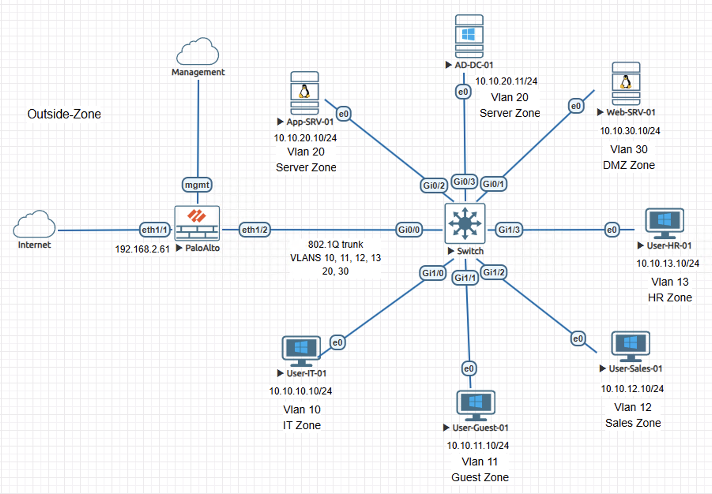
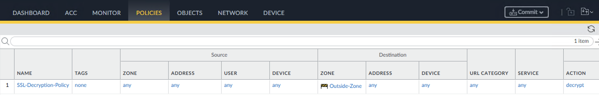
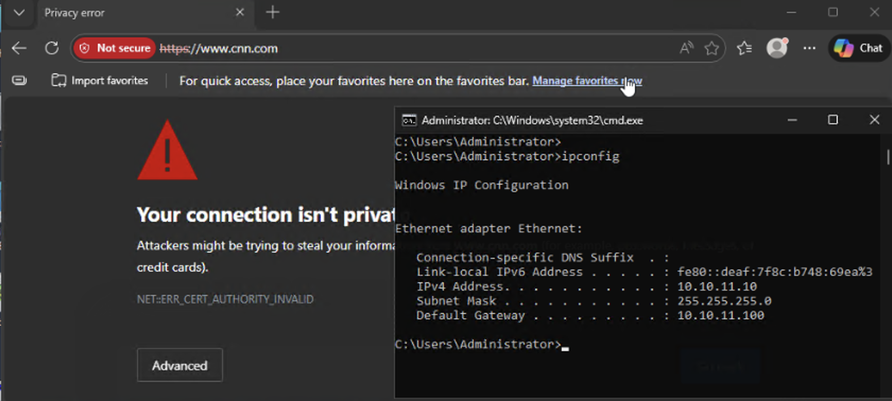
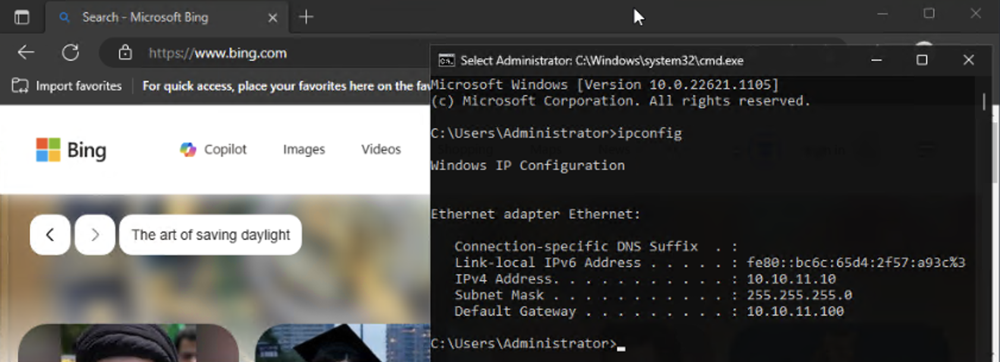

# Incident Case Study - SSL Forward Proxy Scope Failure on Palo Alto NGFW

## Overview

This case study reproduces an incident where a user connected to a guest network could not access external HTTPS websites and received browser certificate validation errors. The failure occurred even though routing, outbound connectivity, and firewall security policy enforcement were operating normally.

The content is documented as a validated engineering case note rather than a configuration walkthrough.

## Impact

A user connected to the guest network was unable to access external HTTPS websites, preventing normal web browsing from the affected device.

## Symptoms Observed

- The client device attempting to browse external HTTPS websites received TLS certificate validation errors.
- Traffic logs showed outbound sessions from Guest-Zone to Outside-Zone identified as application ssl.
- The sessions were allowed by the firewall security policy but HTTPS browsing still failed.

## Investigation Process

1. Reviewed browser certificate details and observed that the certificate presented during TLS negotiation was issued by the firewall Forward Trust certificate authority rather than the origin server, confirming that SSL Forward Proxy inspection was occurring.

2. Performed a controlled comparison using a managed corporate device and confirmed HTTPS browsing succeeded while SSL inspection remained enabled.

3. Compared the managed device behavior with the guest device and isolated the failure to the unmanaged guest segment rather than to the inspection certificate authority itself.

4. Reviewed the SSL decryption policy and confirmed that the Guest network matched the SSL Forward Proxy inspection rule.

## Root Cause

The SSL Forward Proxy decryption policy was broadly scoped and included the Guest network, applying TLS inspection to unmanaged devices that were not intended to participate in enterprise certificate trust.

## Resolution

- Modified the SSL decryption policy to exclude the Guest network from SSL inspection.
- Placed the Guest No-Decrypt rule above the general SSL Forward Proxy inspection rule so the exclusion matched before the broader inspection rule during first-match evaluation.

## Validation After Fix

- Guest devices successfully accessed external HTTPS websites.
- Browser certificate details showed the origin server certificate rather than the firewall Forward Trust certificate authority, confirming that SSL inspection was no longer applied to guest sessions.

## Engineering Lessons

- This pattern commonly occurs when SSL inspection policies are applied broadly without considering device ownership boundaries such as guest Wi-Fi or BYOD segments.

- During SSL Forward Proxy inspection the firewall presents a certificate signed by the enterprise trust authority, which managed endpoints are expected to trust.

- When inspection scope extends to unmanaged networks that do not trust this certificate authority, certificate validation failures can occur even though firewall security policy logs appear normal.

- Decryption policy scope should therefore align with network segmentation and device ownership during deployment so inspection is applied only to devices intended to participate in enterprise certificate trust.

## Lab Environment

- Palo Alto NGFW
- Cisco switch
- Servers
- Client workstations
- EVE-NG lab environment

## Status

Validated and complete
