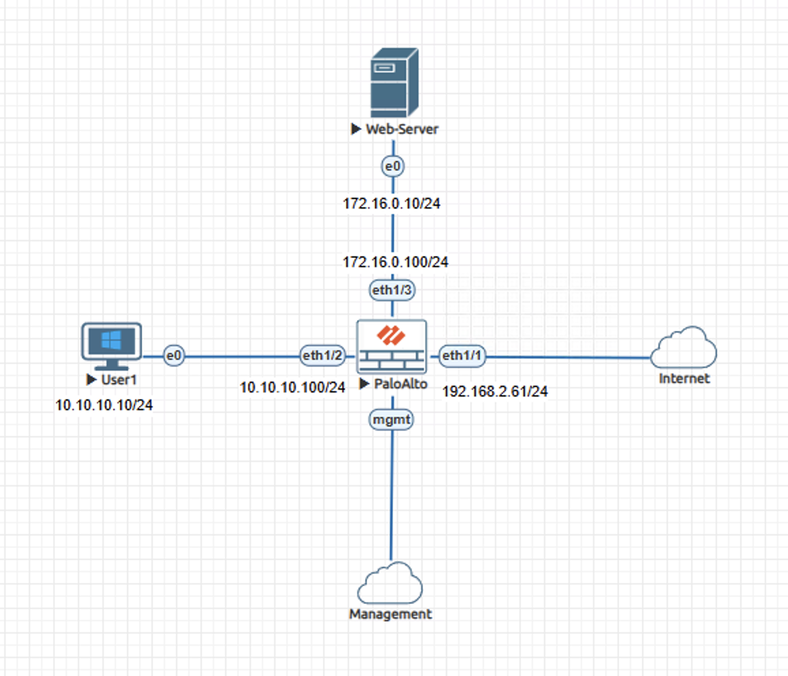
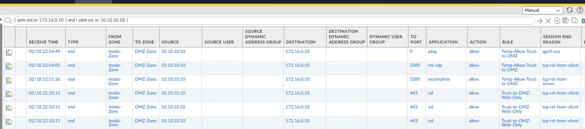
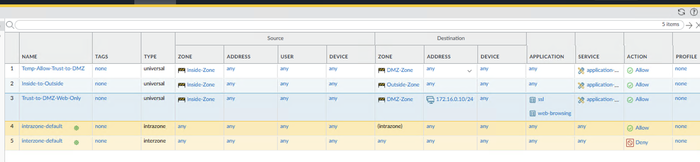
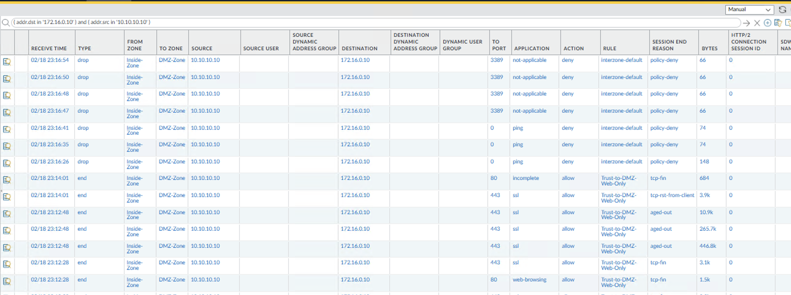

# Incident Case Study - Security Policy Rule Order Failure on Palo Alto NGFW

## Overview

This case study reproduces an incident where non-web traffic from the Trust zone was permitted to a DMZ web server due to security policy rule ordering. RDP and ICMP sessions were allowed across zones despite a restrictive web-only control being defined.

The content is documented as a validated engineering case note rather than a configuration walkthrough.

## Impact

Systems in the Trust zone were able to access the DMZ web server over RDP and ICMP, bypassing the intended web-only segmentation boundary between internal users and the DMZ.

## Symptoms Observed

- RDP sessions from Trust to DMZ completed with action allow
- ICMP sessions from Trust to DMZ completed with action allow
- Traffic logs showed Trust-to-DMZ sessions matching a broad allow rule
- Hit counters incremented on the permissive rule while the restrictive web-only rule did not increase

## Investigation Process

1. Filtered traffic logs for Trust-to-DMZ sessions.
2. Identified ms-rdp and ping sessions marked allow.
3. Correlated those sessions to the broad Trust-to-DMZ allow rule.
4. Reviewed security policy order and evaluation behavior.
5. Confirmed first-match evaluation permitted sessions before the restrictive control was evaluated.
6. Verified hit counter behavior aligned with observed rule matches.

## Root Cause

A broad Trust-to-DMZ allow rule remained positioned above the restrictive web-only rule, causing first-match evaluation to permit all Trust-to-DMZ sessions during session establishment.

## Resolution

Removed the broad Trust-to-DMZ allow rule that had remained above the restrictive control and enabled logging on the interzone-default deny rule to restore segmentation enforcement and improve visibility.

## Validation After Fix

- RDP from Trust to DMZ denied under interzone-default
- ICMP from Trust to DMZ denied under interzone-default
- HTTP traffic allowed under the web-only rule
- HTTPS traffic allowed under the web-only rule
- Traffic logs confirmed correct rule match behavior and enforcement order

## Engineering Lessons

- This pattern commonly occurs when temporary access rules are introduced during troubleshooting and not removed or properly re-scoped.
- First-match policy evaluation at session creation makes rule order a critical segmentation control.
- Hit counters and session logs provide immediate visibility into rule precedence behavior and enforcement gaps.

## Lab Environment

- Palo Alto NGFW
  - eth1/1 Outside
  - eth1/2 Inside - Trust zone (10.10.10.0/24)
  - eth1/3 DMZ (172.16.0.0/24)
- Client workstation
- Web Server
- EVE-NG lab environment

## Status

Validated and complete.
