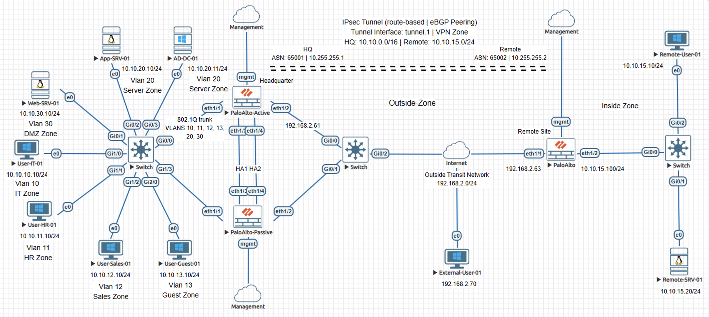
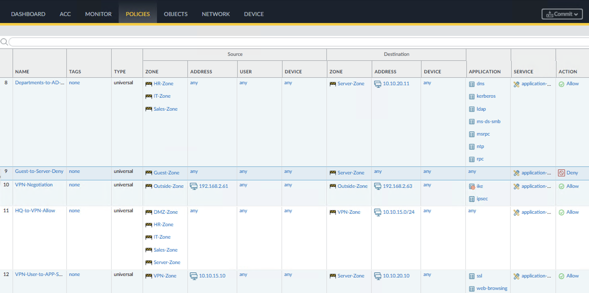
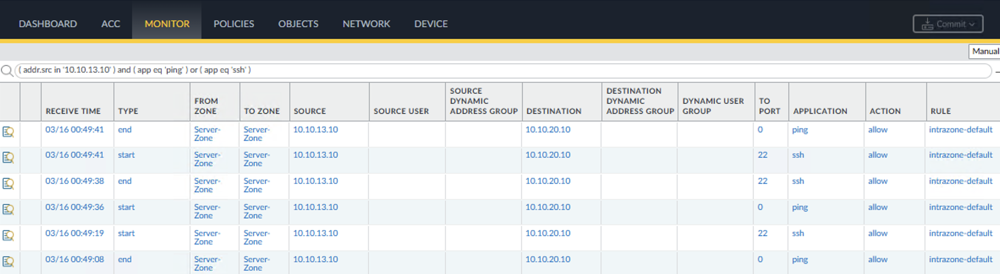
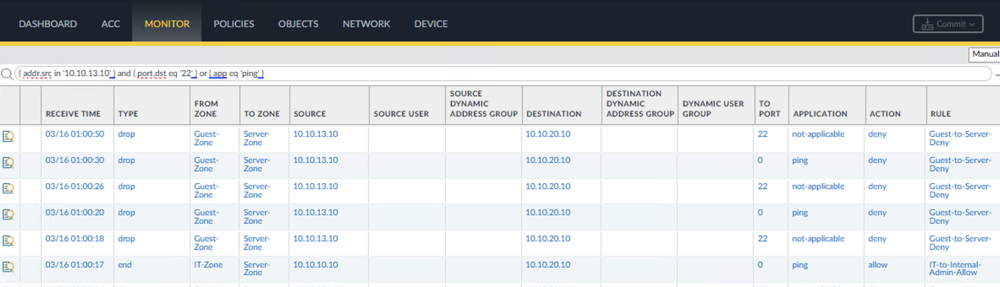

# Incident Case Study - Security Zone Misconfiguration on Palo Alto NGFW

## Overview

This case study reproduces an incident where segmentation between a guest network and internal servers failed unexpectedly even though a deny policy intended to enforce that boundary was correctly defined. The condition resulted in unintended lateral access despite the presence of a correctly ordered deny rule.

The content is documented as a validated engineering case note rather than a configuration walkthrough.

## Impact

Internal server assets including App-SRV-01 and AD-DC-01 were reachable from the guest network. This exposure introduced potential lateral movement risk between an untrusted network segment and sensitive internal infrastructure.

## Symptoms Observed

- Intrazone-default rule matched with action allow.
- Guest-to-Server-Deny rule recorded no hits.
- Guest users were able to access internal server resources.

## Investigation Process

1. Reviewed traffic log session details and confirmed sessions were matching intrazone-default rather than the intended Guest-to-Server-Deny rule.
2. Reviewed security policy order and confirmed Guest-to-Server-Deny was positioned correctly above intrazone-default.
3. Inspected the VLAN 13 subinterface configuration and identified the guest VLAN subinterface was assigned to Server-Zone instead of Guest-Zone.
4. Confirmed both the guest subnet and server subnet were mapped to Server-Zone.

## Root Cause

The VLAN 13 guest network subinterface was assigned to Server-Zone instead of Guest-Zone, causing guest-to-server traffic to be evaluated as intrazone traffic.

## Resolution

The VLAN 13 subinterface was reassigned to Guest-Zone and configuration changes were committed. Traffic flows were re-tested to validate segmentation enforcement.

## Validation After Fix

- Guest to server traffic classified as Guest-Zone to Server-Zone.
- Guest-to-Server-Deny rule matched and enforced deny.
- Multiple ping and SSH attempts from the guest client to internal servers were blocked.

## Engineering Lessons

- This pattern commonly occurs during VLAN expansion or network segmentation redesign when interface mappings are modified without validating enforcement boundaries.
- Zone classification determines which policy path traffic follows before rule evaluation.
- Segmentation validation must confirm both rule logic and interface-to-zone alignment. Policy simulation tools alone will not detect zone boundary removal when rules themselves are correctly defined.
- In production environments, a failure of this type could expose directory services and application infrastructure to an untrusted guest network segment.

## Lab Environment

- Palo Alto NGFWs
- Cisco switches
- Servers
- Client workstations
- EVE-NG lab environment

## Status

Validated and complete.
