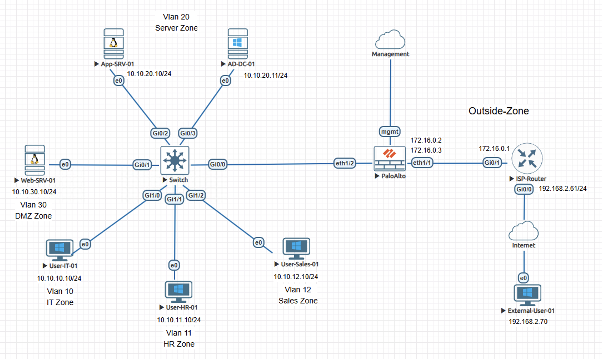
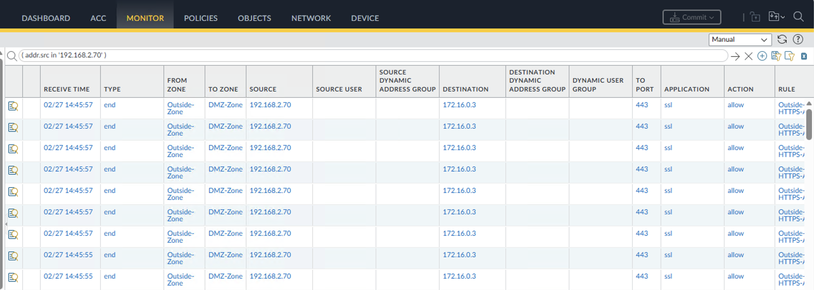
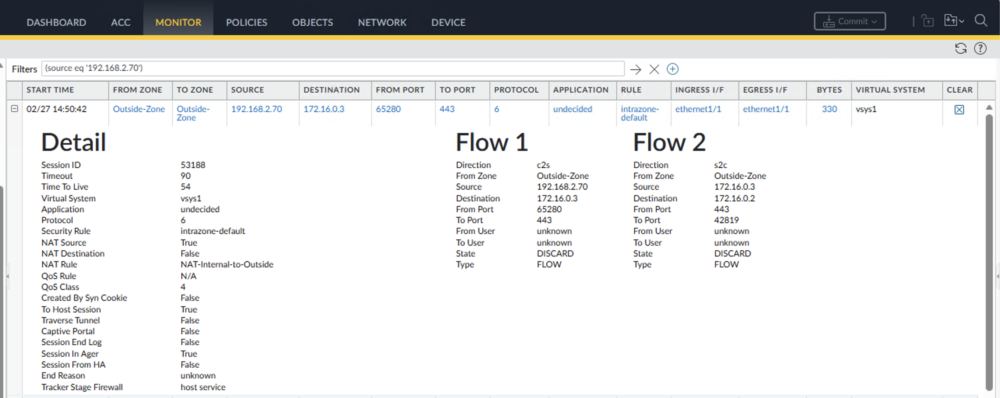
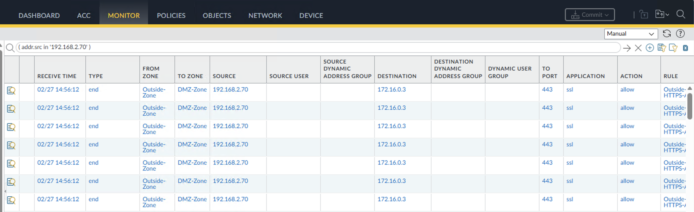

# Incident Case Study - Source NAT Conflict on Palo Alto NGFW

## Overview

This case study reproduces an incident where inbound HTTPS publishing to a DMZ web server stopped functioning after a NAT policy modification. External clients could not establish sessions to the public IP despite routing and security policy appearing operational.

The content is documented as a validated engineering case note rather than a configuration walkthrough.

## Impact

Inbound HTTPS access to the published DMZ web service was unavailable from external networks. Business-facing services hosted behind the firewall could not be reached.

## Symptoms Observed

- External HTTPS connections to the public IP failed.
- Traffic logs showed traffic remaining in Outside-Zone.
- Sessions matched the intrazone-default security rule.
- Application remained undecided in failed sessions.
- Session state recorded as discard.

## Investigation Process

1. Verified external host connectivity to the firewall outside interface to eliminate reachability issues.
2. Confirmed the HTTPS DNAT rule remained configured to eliminate configuration removal as a cause.
3. Inspected traffic logs and observed no zone transition to DMZ, indicating destination translation was not occurring.
4. Opened detailed session view and confirmed source translation occurred while destination translation did not.
5. Correlated the translation behavior with NAT rule order and identified a source NAT rule positioned above the DNAT rule.

The absence of destination translation, combined with observed source translation, directed attention to NAT evaluation order rather than DNAT rule existence.

## Root Cause

A source NAT rule evaluated before the HTTPS DNAT rule due to NAT policy order precedence.

This prevented destination translation, causing the session to remain in the Outside-Zone and match the intrazone-default discard rule.

## Resolution

Reordered NAT policies to ensure the HTTPS DNAT rule evaluated before the source NAT rule and committed the configuration.

## Validation After Fix

- Traffic logs showed From Zone: Outside-Zone and To Zone: DMZ-Zone.
- Application identified as ssl.
- Security policy correctly allowed the session.
- Destination translation occurred from the public IP to the internal DMZ server.
- External HTTPS access restored successfully.

## Engineering Lessons

- This pattern commonly occurs when NAT policy evaluation order is not validated when publishing internal services.
- Translation evaluation order directly influences zone classification and downstream security enforcement.
- Publishing failures may appear as security rule issues while the underlying condition is NAT precedence behavior.

## Lab Environment

- Palo Alto NGFW
- Cisco router
- Cisco switch
- Servers
- Client workstations
- EVE-NG lab environment

## Status

Validated and complete.
