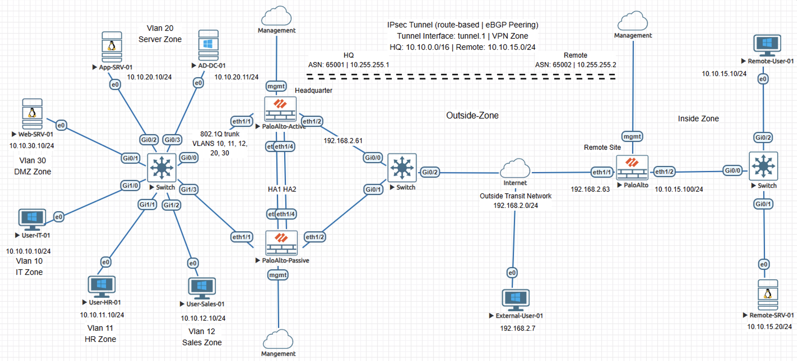
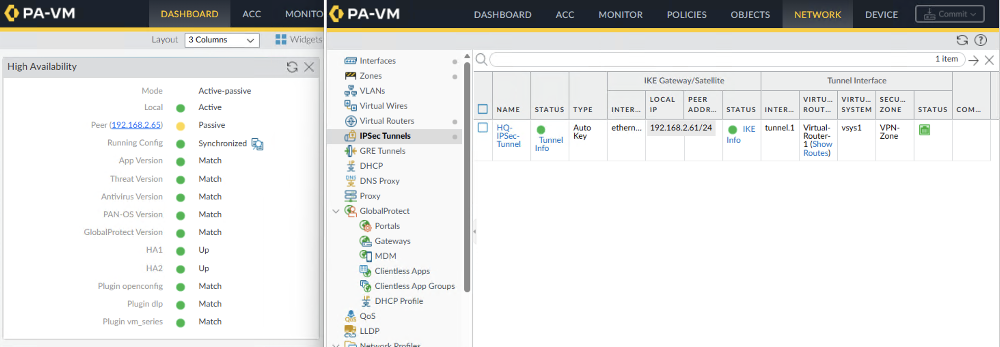
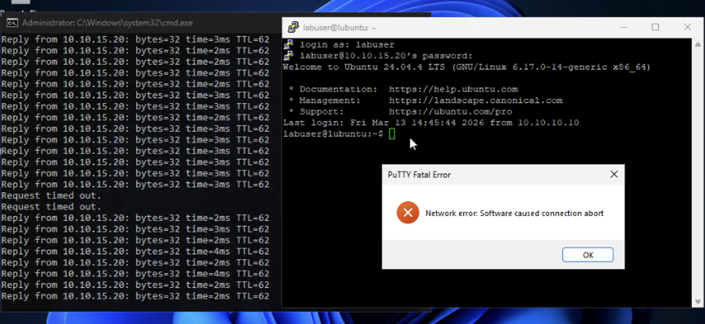
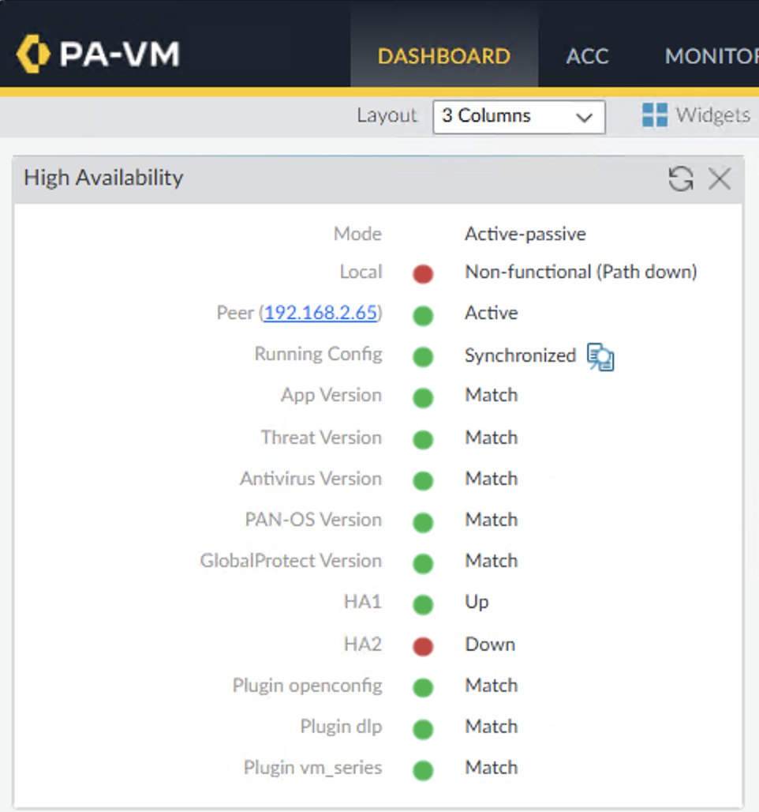
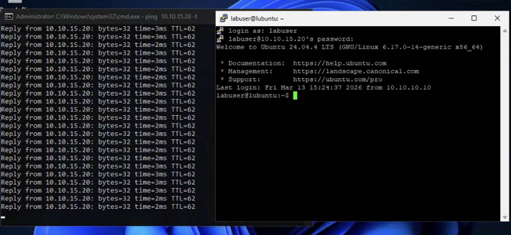

# Incident Case Study - Stateful Session Loss During HA Failover on Palo Alto NGFW

## Overview

This case study reproduces an incident where active sessions between a headquarters network and a remote site terminated during a firewall high availability failover event even though basic reachability quickly recovered. Existing sessions did not survive the role transition, while new sessions created after failover established successfully.

The content is documented as a validated engineering case note rather than a configuration walkthrough.

## Impact

Users experienced unexpected disconnections during the failover event. Connectivity monitoring quickly recovered and routing adjacencies remained established, so the failure was not immediately visible through standard operational checks.

## Symptoms Observed

- Active application sessions unexpectedly disconnected during the failover event
- Continuous ICMP monitoring showed brief packet loss followed by immediate reachability recovery

## Investigation Process

1. Verified the IPsec tunnel remained established and the tunnel interface was operational.
2. Confirmed BGP peering across the VPN tunnel returned to the Established state after failover.
3. Tested new sessions across the same path and confirmed they established successfully, indicating routing, VPN connectivity, and security policy enforcement were functioning normally.
4. Reviewed the HA cluster dashboard and confirmed a firewall role transition occurred during the event.
5. Examined HA status and observed synchronization warnings reported by the peer firewall.
6. Checked HA1 and HA2 link status and identified the HA2 synchronization link was unavailable.
7. Compared behavior between new sessions and previously established sessions, confirming that flows created before failover were dropped while new flows succeeded, isolating session state synchronization as the failure variable.

## Root Cause

The HA2 data link was down, preventing session table synchronization between the HA peers.

Without HA2 synchronization, the standby firewall did not receive session table updates from the active peer. When failover occurred and the standby firewall assumed the active role, packets from existing flows arrived without matching session entries. Because PAN-OS performs stateful inspection, packets that do not match an existing session are discarded, causing active flows established before failover to terminate.

## Resolution

The HA2 synchronization link between the firewalls was restored, allowing session table replication between the peers to resume. Once synchronization was restored, the standby firewall maintained an up-to-date session table and existing flows remained active.

## Validation After Fix

HA status showed both HA1 and HA2 links in an operational state with synchronized configuration. Continuous connectivity monitoring remained stable during controlled failover testing, and existing sessions remained active during failover once session synchronization was restored.

## Engineering Lessons

- This pattern most commonly appears at branch or site edge firewalls where high availability pairs protect connectivity between locations.
- When the HA2 synchronization link fails, standard connectivity checks such as tunnel status, routing adjacency, and ICMP monitoring can appear healthy while active sessions are silently dropped during failover.
- HA link health should therefore be monitored as part of the operational baseline.

## Lab Environment

Palo Alto NGFWs
Cisco switches
Servers
Client workstations
EVE-NG lab environment

## Status

Validated and complete.
