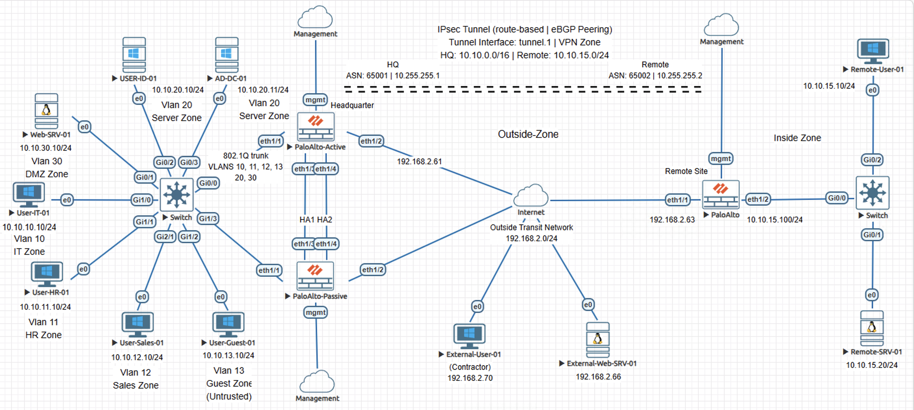
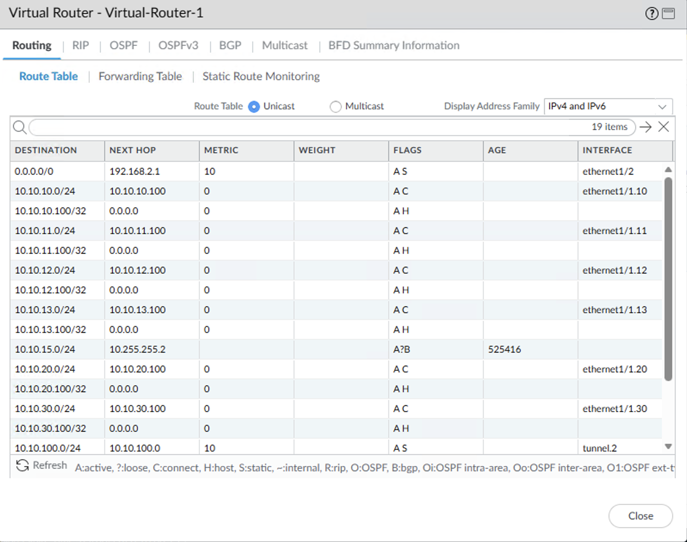
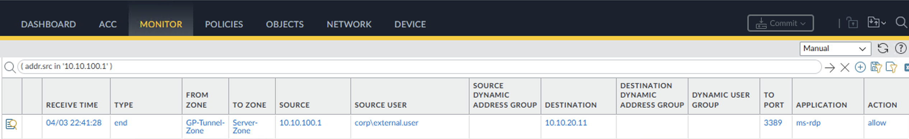
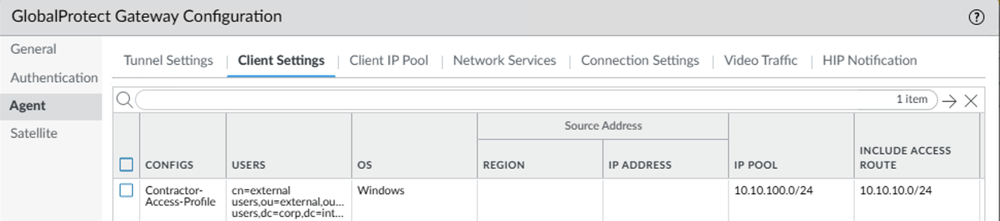

# Incident Case Study - Zero Trust Policy Failure Allowing Unintended Server Zone Access on Palo Alto NGFW

This case study reproduces an incident where a GlobalProtect contractor user accessed a restricted Server Zone subnet through a VPN tunnel, exposing a Zero Trust policy failure.

The content is documented as a validated engineering case note rather than a configuration walkthrough.

## Impact

Unauthorized access to the Server Zone was possible from GlobalProtect contractor users, exposing critical server infrastructure to unintended reachability. The activity occurred without any enforcement or detection, as no deny logs or alerts were generated during the access window.

## Symptoms Observed

- GlobalProtect gateway session data showed contractor user assigned a tunnel IP
- Traffic logs showed sessions from the VPN tunnel zone to the Server Zone allowed by an existing security policy
- No deny logs recorded for this traffic
- No alerting triggered for contractor sessions

## Investigation Process

1. Verified GlobalProtect gateway session and user assignment
2. Reviewed GlobalProtect gateway current-user output for assigned user session
3. Verified assigned split tunnel access routes in GlobalProtect client settings
4. Correlated traffic logs with matching security policy
5. Reviewed GlobalProtect client profile configuration against intended access design

## Root Cause

The Server Zone subnet was incorrectly included in the Contractor-Access-Profile split tunnel routes during an IT user onboarding change window. The GP-Tunnel-to-Server-Zone security policy, written without identity scoping, failed to act as a backstop.

## Resolution

The Server Zone subnet was removed from the contractor access profile split tunnel configuration, and the security policy was restricted to IT users only.

## Validation After Fix

- GlobalProtect gateway current-user output shows that the contractor access profile no longer includes the Server Zone subnet in its assigned access routes
- No new sessions observed from the VPN tunnel zone to the Server Zone for contractor accounts in traffic logs

## Engineering Lessons

- This pattern commonly occurs in enterprise GlobalProtect deployments during access profile changes such as onboarding new user groups, expanding remote access scope, or copying profiles as templates.
- Security policy must operate as an independent control layer because reachability and authorization are enforced separately.
- This is a Zero Trust implementation failure, not a configuration mistake. Enforcement layers are treated as compensating controls instead of independently validating access. No single control failed. The breakdown occurs in the interaction between controls.

## Lab Environment

- Palo Alto NGFWs
- Cisco switches
- Servers
- Client workstations
- EVE-NG lab environment

## Status

Validated and complete.
