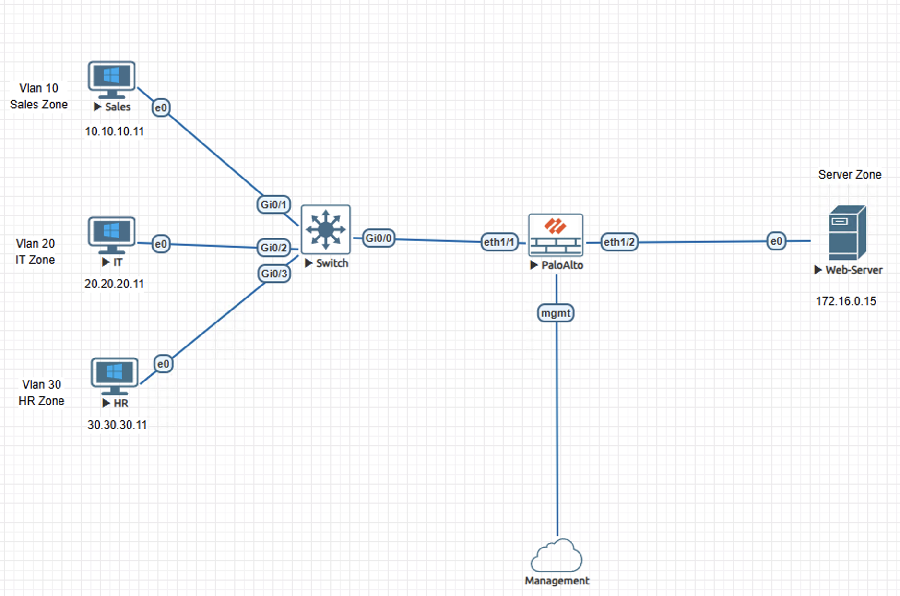
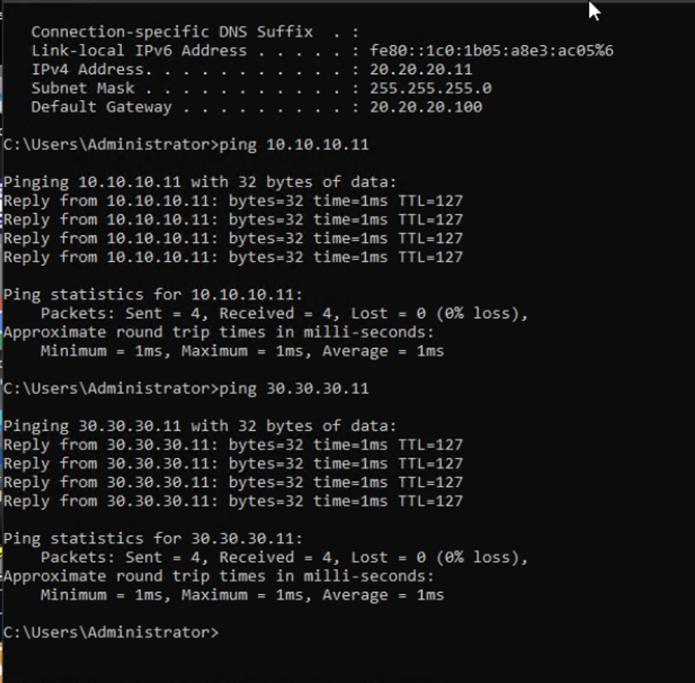
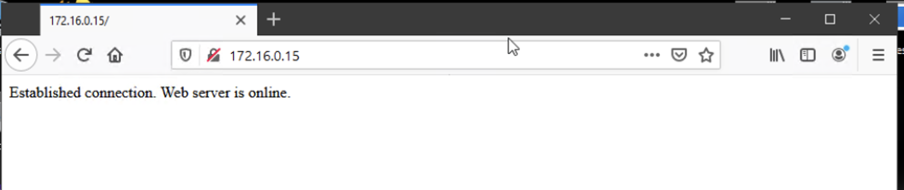
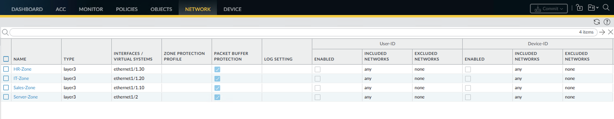

# Lab – Inter-VLAN Segmentation on Palo Alto NGFW

## Overview
This lab demonstrates inter-VLAN routing through a Palo Alto NGFW using subinterfaces and security policy enforcement to control segmented network reachability.

This lab is documented as a validated engineering case note rather than a configuration walkthrough.

## Lab Objectives
- Establish routed connectivity between multiple VLANs through a centralized firewall
- Enforce controlled reachability using firewall security policies
- Confirm expanded access permissions for the IT VLAN
- Prevent unintended lateral communication between non-authorized user VLANs

## Topology Summary
The environment consists of multiple user VLANs connected to a switch and trunked to a Palo Alto NGFW. The firewall terminates VLAN subinterfaces, applies zone-based policy enforcement, and routes traffic toward a protected server segment while explicitly denying unauthorized inter-VLAN communication.

## Configuration Summary
- VLAN trunking between switch and firewall
- Layer 3 subinterfaces mapped to security zones
- Security policies defining permitted and prohibited traffic flows

(Configuration details intentionally omitted; focus is on behavior and validation.)

## Validation and Results
Traffic behavior was validated against an explicit reachability model using firewall policy enforcement.

- IT VLAN demonstrated consistent access to all internal VLANs as permitted by policy
- Sales and HR VLANs successfully accessed the server network while being denied peer VLAN communication
- Validated explicit blocking of Sales-to-HR, Sales-to-IT, and HR-to-Sales communication attempts
- Application-layer access to the web server confirmed policy enforcement beyond ICMP

Validation results were repeatable and aligned with the intended access control design.

## Key Takeaways
- Firewall security policies provide precise control over inter-VLAN communication
- Explicit path-based validation strengthens confidence in segmentation effectiveness
- Required access is allowed, while unnecessary internal network access is intentionally blocked

## Lab Environment
- Palo Alto NGFW (VM-Series)
- Cisco switching infrastructure
- EVE-NG

## Status
Validated and complete.
