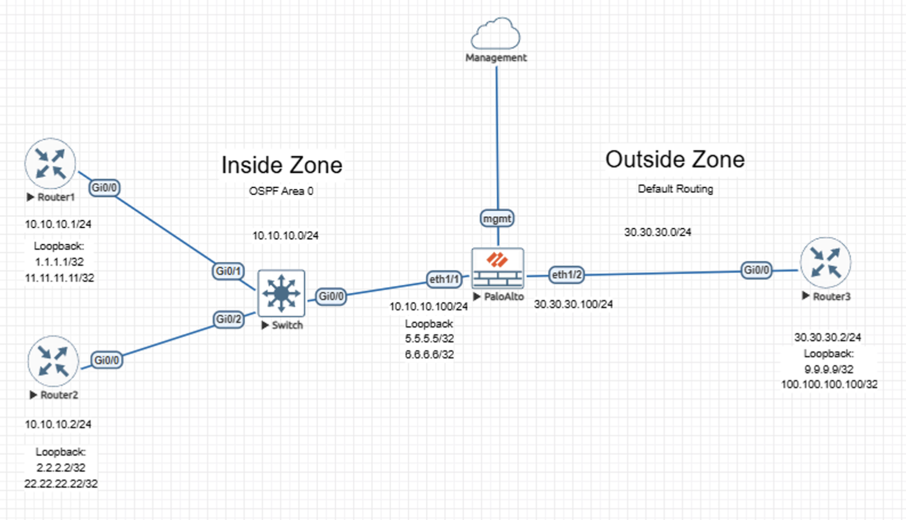
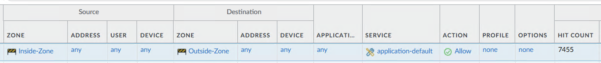

# Lab – Inter-Zone Policy Enforcement on Palo Alto NGFW

## Overview
This lab demonstrates how a Palo Alto Networks NGFW enforces explicit inter-zone security policy, with routing providing reachability context. The focus is on observable policy-governed traffic behavior at the zone boundary. 

The content is documented as a validated engineering case note rather than a configuration walkthrough.

## Lab Objectives
- Demonstrate that inter-zone traffic is permitted by security policy rather than routing state
- Verify explicit policy enforcement between Inside and Outside zones
- Confirm observable enforcement behavior through firewall state
- Reinforce separation of routing reachability and security authorization

## Topology Summary
The topology consists of internal networks connected to an Inside zone and an external network connected to an Outside zone, with a Palo Alto Networks NGFW enforcing the security boundary between them. Routing provides reachability between zones, while all traffic crossing the zone boundary is governed by explicit security policy.

## Configuration Summary
- Zone-based interface assignment for Inside and Outside segments
- Routing configuration providing reachability between zones
- Explicit inter-zone security policy permitting controlled traffic flow 

(Configuration details intentionally omitted; focus is on behavior and validation.)

## Validation and Results

### Proof of Correct Enforcement Behavior
- Inter-zone traffic between Inside and Outside networks was generated
- Traffic matched an explicit inter-zone security policy rule
- Security policy hit counts incremented, confirming active enforcement
- Traffic flow occurred only as a result of policy evaluation, not implicit routing behavior

This permissive inter-zone rule is intentionally used to demonstrate that routing enables reachability, but security policy—not routing—ultimately determines whether traffic is permitted.

## Key Takeaways
- Routing enables reachability but does not grant access
- Inter-zone communication is explicitly controlled by firewall policy
- Policy hit counts provide defensible evidence of enforcement behavior

## Lab Environment
- Palo Alto Networks NGFW (VM-Series)
- Cisco routers
- EVE-NG virtual lab platform

## Status
Validated and complete.
