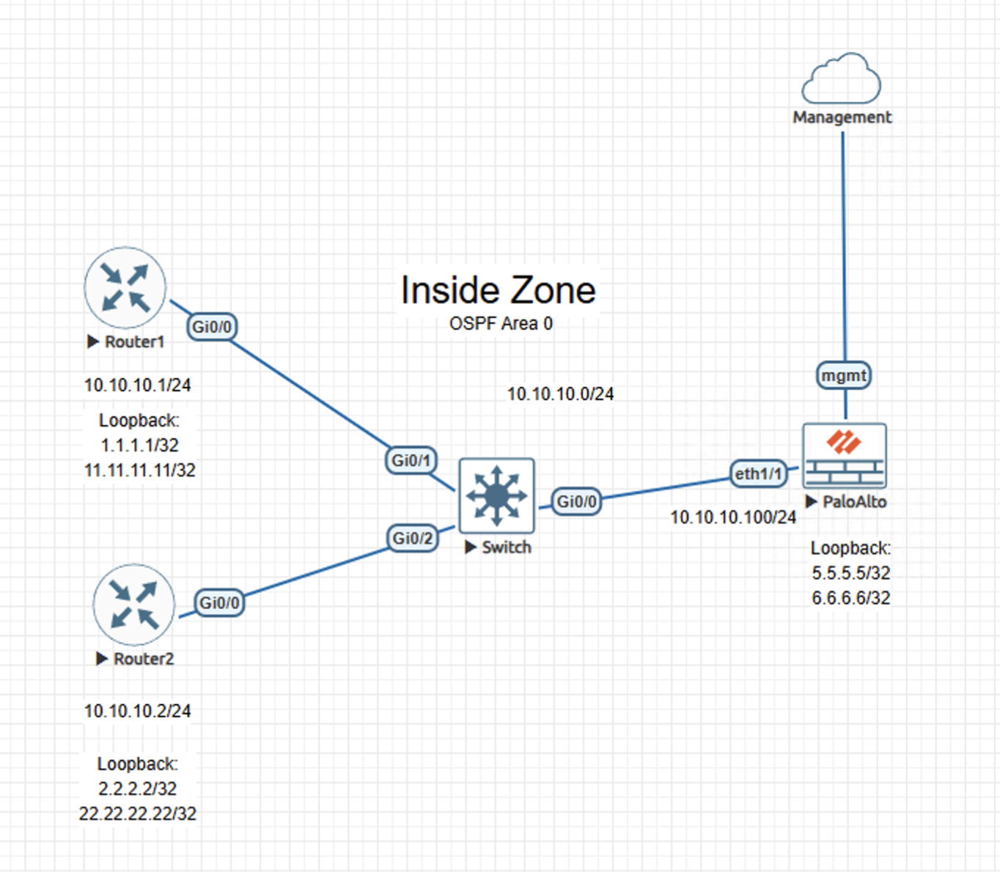

# Lab – OSPF Configuration and Management

## Overview
This lab demonstrates OSPF Area 0 control-plane behavior between a Palo Alto Networks NGFW and Cisco routing peers. The focus is on adjacency formation, route propagation, and next-hop resolution rather than configuration mechanics.

This lab is documented as a validated engineering case note rather than a configuration walkthrough.

## Lab Objectives
- Validate stable OSPF neighbor adjacencies
- Confirm intra-area route installation on the NGFW
- Verify deterministic next-hop resolution
- Observe control-plane stability under normal operation

## Topology Summary
The topology consists of multiple Cisco routers and a Palo Alto NGFW participating in OSPF Area 0 over a shared Layer 2 segment within a trusted routing domain. All routing information is exchanged dynamically without static routes.

## Configuration Summary
- OSPF enabled on participating interfaces
- Palo Alto virtual router configured for Area 0
- Loopback interfaces advertised as host routes
- Single-area broadcast topology

(Configuration details intentionally omitted; focus is on behavior and validation.)

## Validation and Results
Proof of correct operational state:
- OSPF adjacencies reached FULL state with all peers
- Intra-area routes installed successfully
- Next-hop resolution aligned with expected peers
- Routing state remained stable during observation

## Key Takeaways
- OSPF integrates cleanly with Palo Alto NGFW routing
- Dynamic routing improves scalability and operational resilience
- Control-plane validation is essential for production readiness

## Lab Environment
- Palo Alto Networks NGFW (VM-Series)
- Cisco routers
- EVE-NG virtual lab platform

## Status
Validated and complete.
