# Palo Alto NGFW Cornerstone Lab - End-to-End Enterprise Security Architecture

## Overview
This lab demonstrates a complete enterprise network architecture built on Palo Alto NGFW with integrated Cisco switching infrastructure, segmentation, identity-driven access control, high availability, VPN connectivity, and threat enforcement.

The focus is on how multiple control layers operate together to enforce security decisions based on identity, zone, application, and threat intelligence, with all outcomes validated through observable behavior.

This lab is documented as a validated engineering case note rather than a configuration walkthrough.

## Lab Objectives
- Build a multi-zone enterprise network with enforced segmentation
- Implement Zero Trust access using User-ID and Active Directory
- Deploy an Active/Passive HA pair with session synchronization
- Establish site-to-site IPsec VPN with eBGP route exchange
- Provide GlobalProtect remote access with group-based policy control
- Apply threat prevention, SSL decryption, and EDL-based blocking
- Enable centralized logging and full visibility via syslog

## Topology

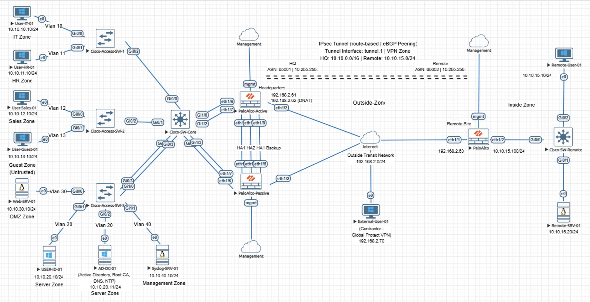

## Security Policy

The full security policy is shown below across the complete rulebase.

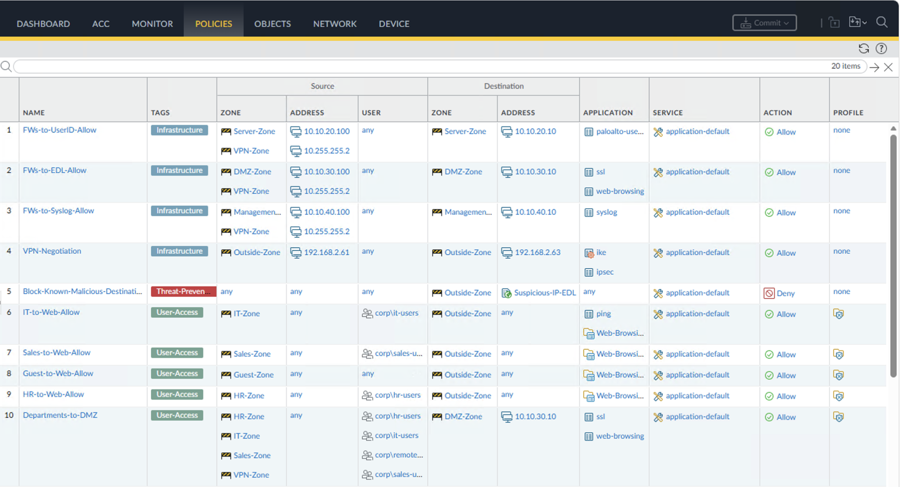
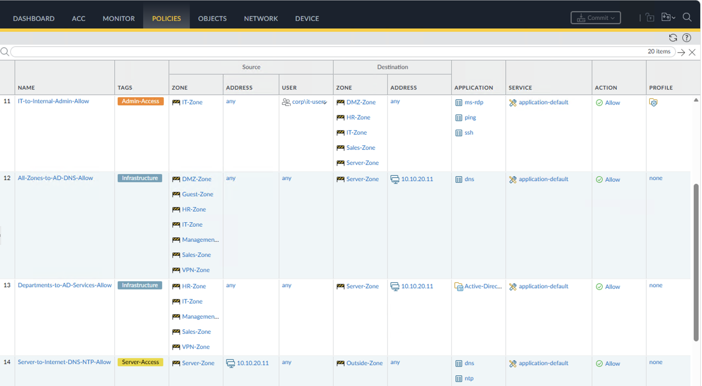
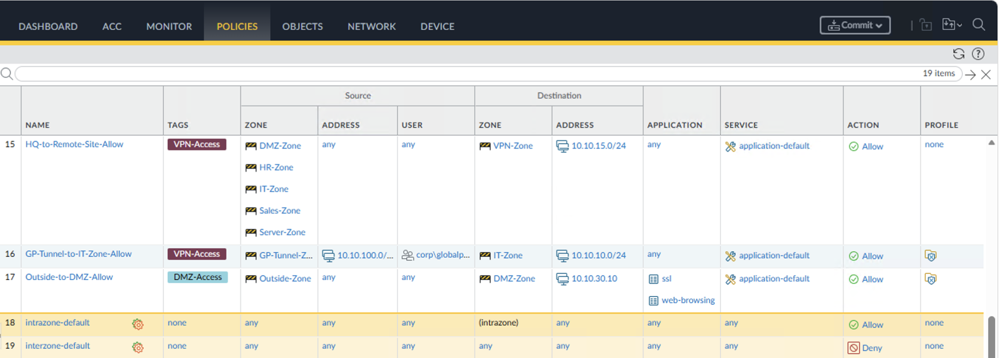

## Key Validation

### User-ID Enforcement
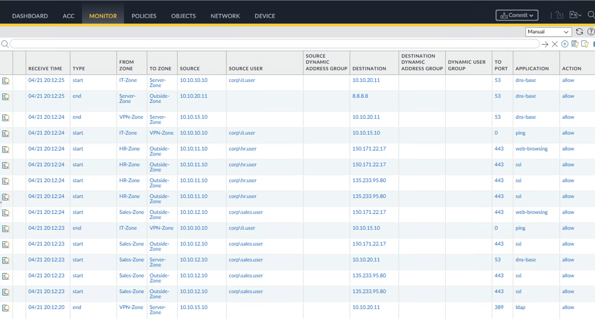

### BGP over IPsec (Route Installed)
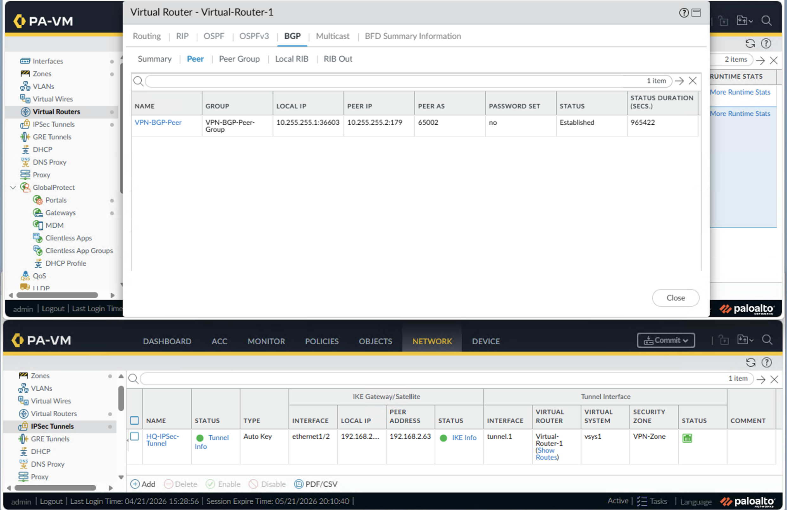

### GlobalProtect Remote Access
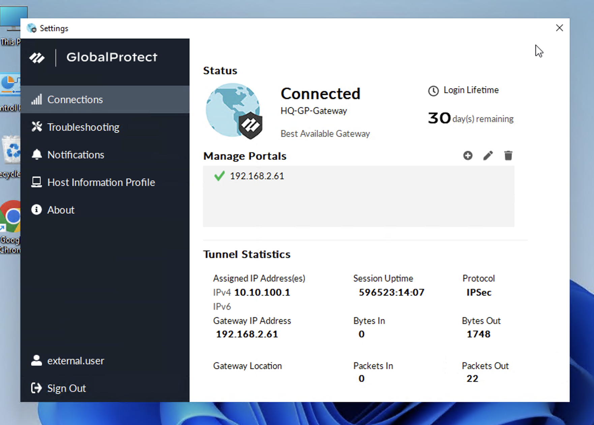

### EDL Enforcement (Threat Blocking)
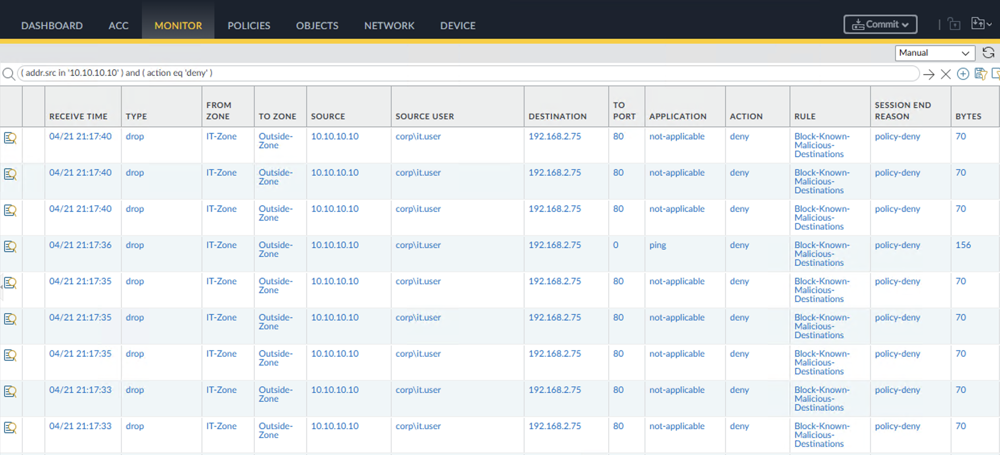

### Syslog Visibility
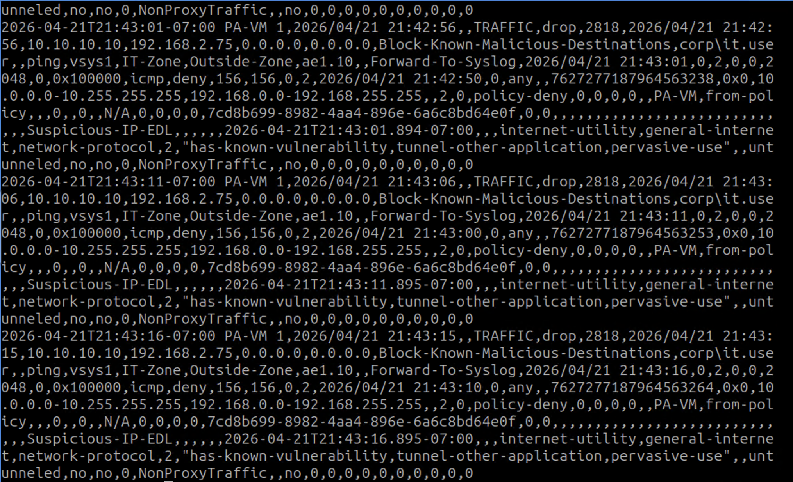

## Additional Validation

### NAT Translation (Source and Destination)
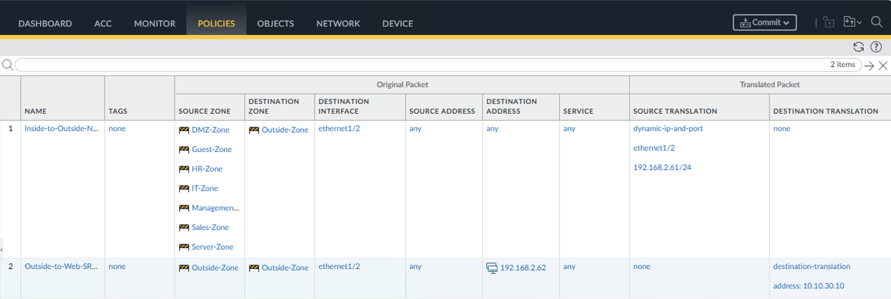

## Architecture Summary

### Segmentation Model
- 10 distinct security zones
- VLAN-backed segmentation across access layer
- Firewall enforces all inter-zone access

### Identity Model
- Active Directory with tiered OU structure (Tier0, Tier1, Tier2)
- User-ID maps IP addresses to user identity
- Security policy enforced based on group membership

### Connectivity Model
- Route-based IPsec VPN between sites
- eBGP used for dynamic route exchange
- GlobalProtect provides remote user access

### Security Model
- Default deny between zones
- Explicit allow rules based on least privilege
- Threat prevention applied to all user traffic
- SSL decryption enables visibility into encrypted sessions

## Zero Trust Enforcement Model

### Identity-Driven Access
- Access based on user identity rather than IP address
- Every session mapped to authenticated user

### Least Privilege
- Each department limited to required access only
- No broad or unrestricted access rules

### Micro-Segmentation
- Access tightly scoped to required resources
- AD, DMZ, and internal services explicitly controlled

### Explicit Deny
- interzone-default denies all unspecified traffic
- All permitted traffic must match explicit policy

### Defense in Depth
- Zone protection (network layer)
- Security policy (access control)
- Security profiles (content inspection)
- EDL (threat intelligence)
- SSL decryption (encrypted traffic inspection)
- User-ID (identity enforcement)
- Syslog (centralized audit trail)

## Validation and Results

- Inter-zone communication validated
- Internet access confirmed per policy
- DNS resolution verified (internal and external)
- User-ID mapping confirmed across all hosts
- Traffic logs show user-based enforcement
- EDL successfully blocks defined indicators
- Syslog receives logs from both firewalls
- IPsec tunnel established and stable
- BGP routes exchanged and installed
- GlobalProtect connection verified
- DNAT to DMZ web server operational
- Zone protection actively detecting scans
- SSL decryption functioning with trusted certificates

## Supporting Validation

### High Availability State
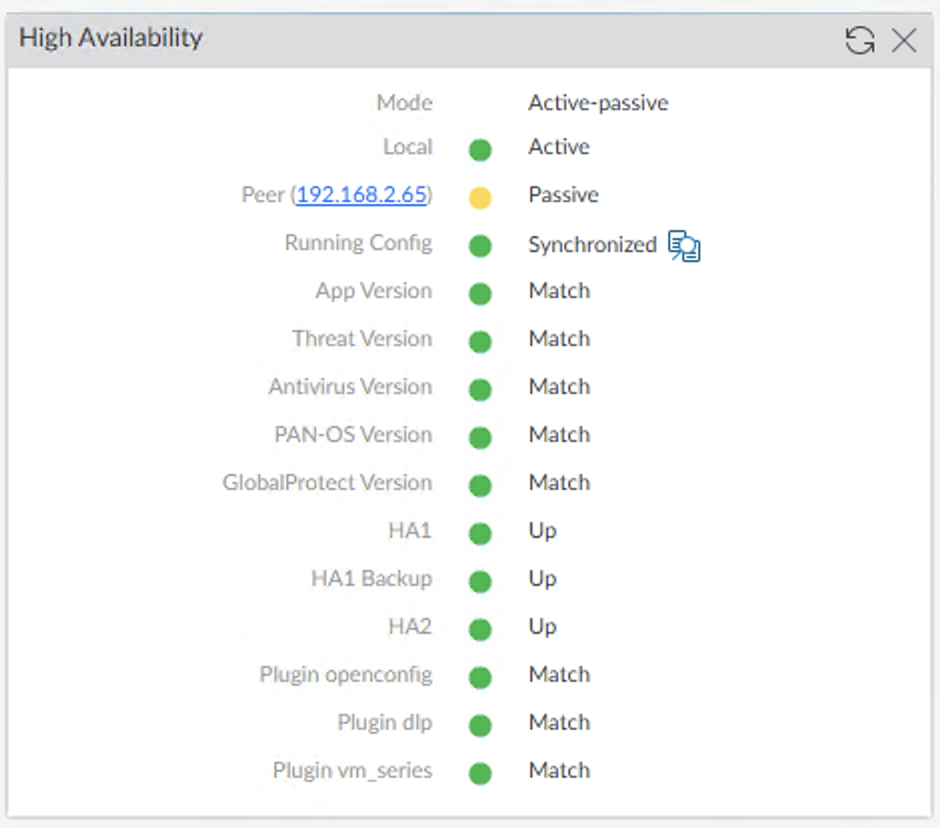

### User-ID Agent Connectivity
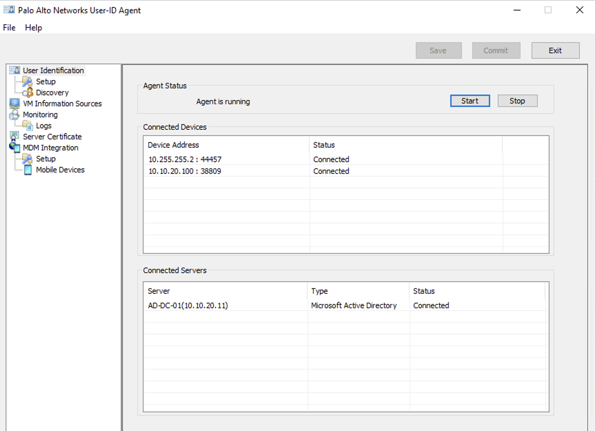

### Group Mapping (Active Directory Integration)
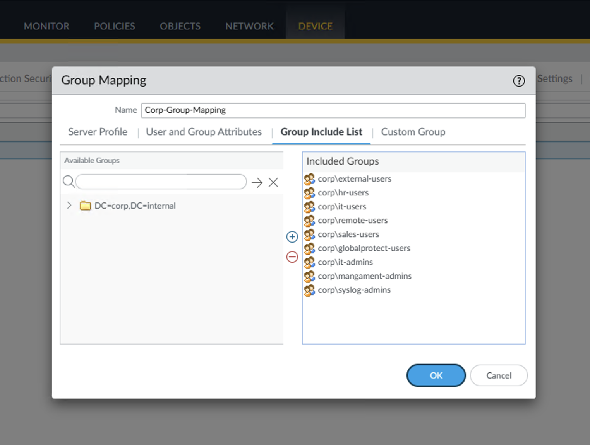

### Active Directory OU Structure
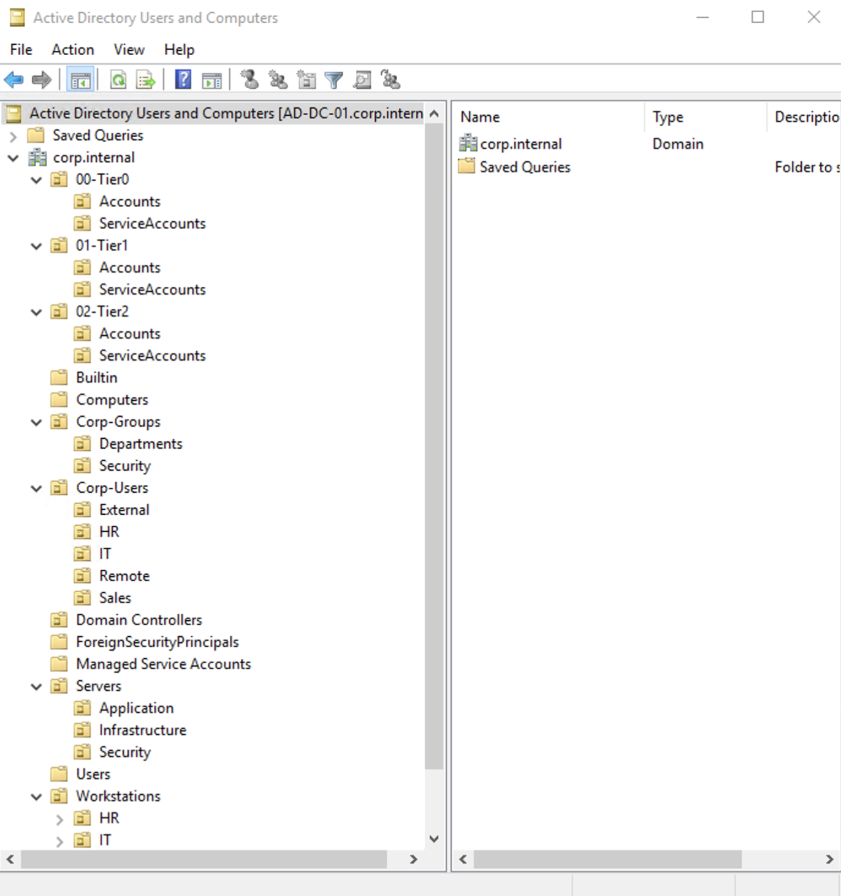

## Key Takeaways

The hardest part of building a secure network is not the configuration. It is understanding why configuration alone is never enough. Routing establishes connectivity, and policy determines what is actually permitted. Getting traffic to flow is straightforward. Ensuring it only flows where identity and policy allow it is where the engineering happens.

That separation extends beyond the security policy layer. Service routes, HA state, and interface selection determine whether features like User-ID, EDL, and syslog function as designed or silently fail.

Encrypted traffic adds another layer. Most modern traffic is SSL. Without decryption, threat prevention has limited visibility. Inspection alone is not enough. Visibility requires decryption.

Centralized logging closes the remaining gap. It brings identity, policy, threat, and session data together into a single, verifiable audit trail, but only when every component contributes to it.

At the center of it all is identity. IP-based controls break down in dynamic environments. Identity-based enforcement ensures access decisions follow the user, not the network location. That is what makes Zero Trust enforceable, not just theoretical.

## Lab Environment
- EVE-NG network emulation platform
- Palo Alto VM-Series
- Cisco IOS switching infrastructure
- Windows Server 2019 (Active Directory, DNS, NTP, Certificate Authority)
- Ubuntu syslog server (rsyslog)
- Linux and Windows endpoints
