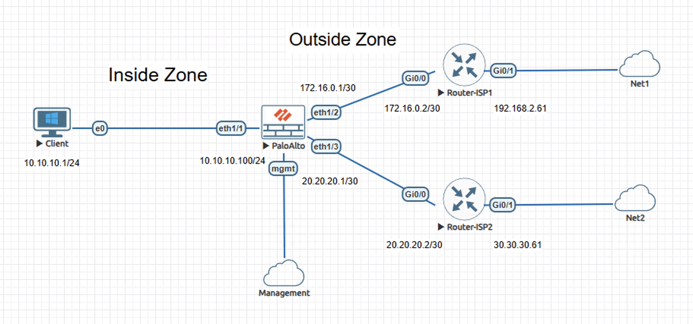
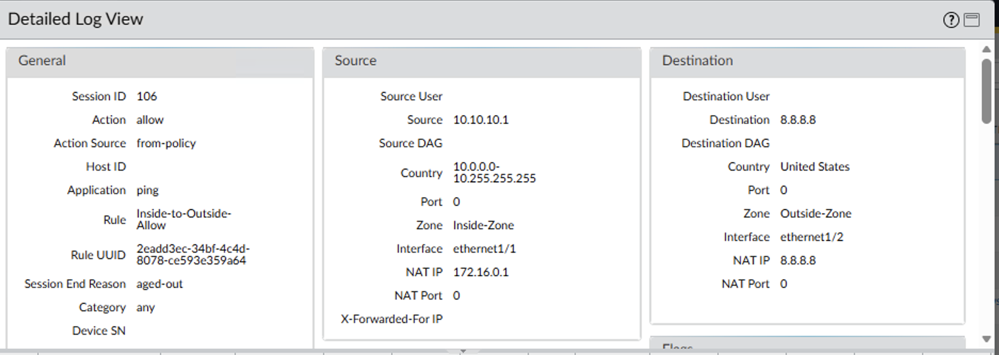
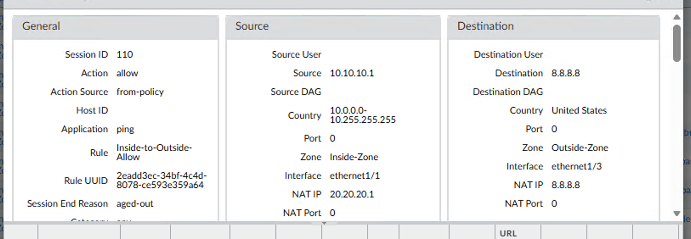

# Lab - Policy-Based Forwarding Path Override on Palo Alto NGFW

This lab demonstrates the use of Policy-Based Forwarding on a Palo Alto NGFW to override default routing behavior and force selected traffic onto a specific upstream path.

The content is documented as a validated engineering case note rather than a configuration walkthrough.

## Lab Objectives
- Confirm normal reachability using default routing behavior
- Override routing decisions using Policy-Based Forwarding
- Verify traffic path selection using session inspection
- Observe behavior when traffic is forced onto an unavailable upstream path

## Topology Summary
The lab includes a Palo Alto NGFW with an inside client network and two upstream ISP connections. Security policy allows inside-to-outside traffic, while Policy-Based Forwarding is used to control which upstream path selected traffic follows. No unauthorized participants are present.

## Configuration Summary
- Security policy allowing inside-to-outside traffic
- Source NAT applied based on upstream path
- Policy-Based Forwarding used to override routing behavior
- No changes made to the routing table

(Configuration details intentionally omitted; focus is on behavior and validation.)

## Validation and Results

### Behavior Without the Control
With default routing in place, ICMP traffic from the inside client to 8.8.8.8 was successful. Session inspection confirmed traffic followed the primary upstream path with the expected NAT source address.

### Behavior With the Control
After Policy-Based Forwarding was applied, the same traffic was forced onto the alternate upstream path. Session inspection confirmed the upstream path and NAT source change, while client testing showed loss of reachability due to the upstream path being unavailable.

## Key Takeaways
- Policy-Based Forwarding provides precise control over traffic path selection without altering routing state
- Session inspection offers clear verification of routing override behavior
- Controlled path selection helps manage exposure to upstream availability issues

## Lab Environment
- Palo Alto NGFW (VM-Series)
- Cisco IOS routers (ISP peers)
- EVE-NG

## Status
Validated and complete.
