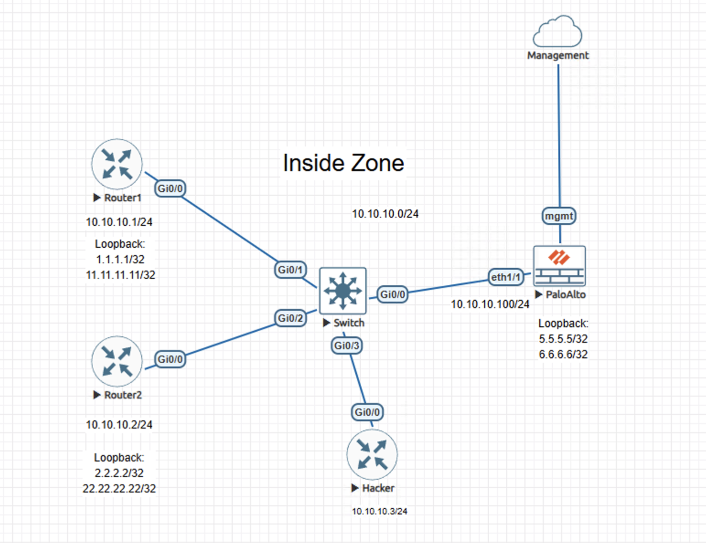
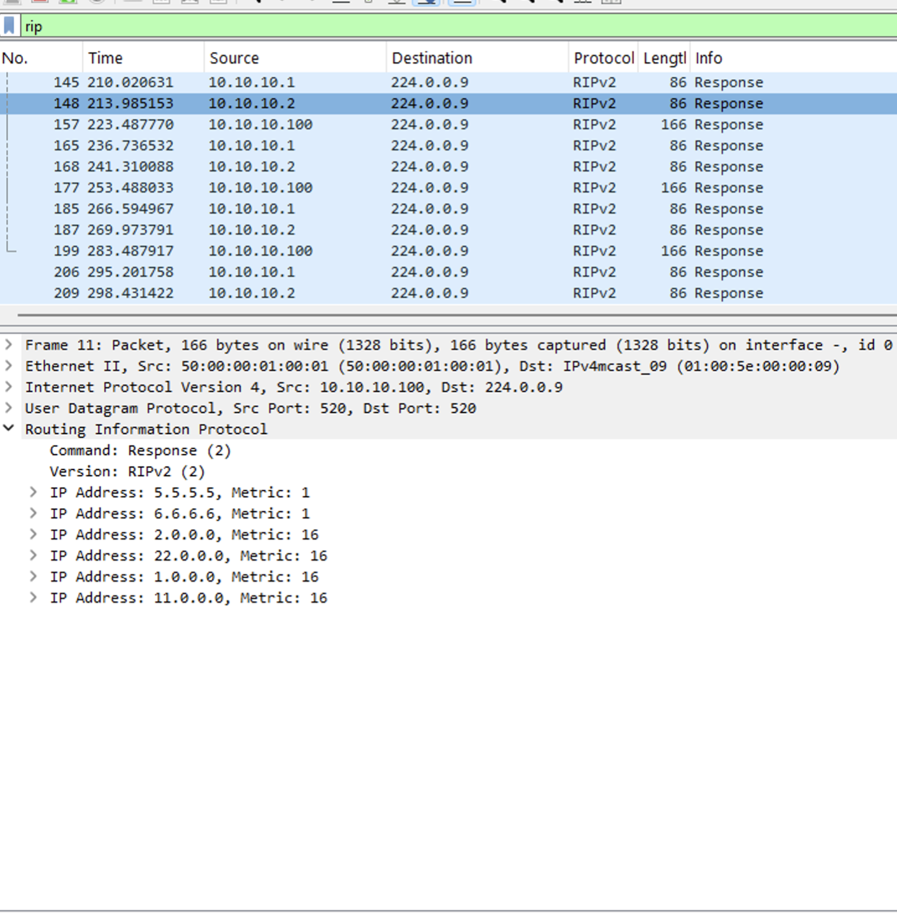
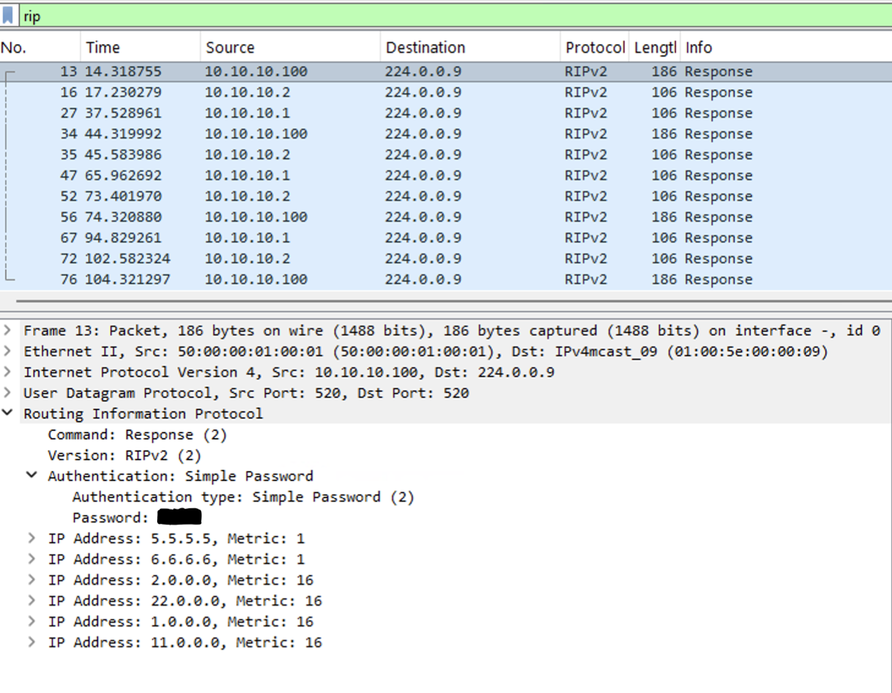

# Lab – RIP Authentication on Palo Alto NGFW

## Overview
This lab demonstrates the security risk of unauthenticated RIP updates on a shared broadcast network and confirms how RIP authentication protects routing updates exchanged between a Palo Alto Networks firewall and Cisco routers. The focus is on observable routing behavior before and after authentication enforcement.

This lab is documented as a validated engineering case note rather than a configuration walkthrough.

## Lab Objectives
- Validate that unauthenticated RIP updates are accepted by any participant on a shared routing segment
- Confirm that authenticated RIP updates are accepted only by trusted peers
- Verify that unauthorized routing updates are rejected after authentication enforcement

## Topology Summary
The topology consists of Cisco routers and a Palo Alto Networks firewall exchanging RIP updates on a shared Layer-2 broadcast network. An additional unauthorized device is present on the same segment to validate routing behavior before and after authentication enforcement.

## Configuration Summary
- RIP enabled on participating routing devices
- Authentication applied to RIP exchanges between trusted peers
- Routing advertisements scoped to authenticated neighbors

(Configuration details intentionally omitted; focus is on behavior and validation.)

## Validation and Results

### Behavior Without the Control
- RIP updates observed in clear text on the broadcast segment
- Unauthorized device successfully received and installed RIP-learned routes

### Behavior With the Control
- RIP updates observed containing authentication information
- Unauthorized device continued to receive RIP packets but failed to install routes
- Trusted peers maintained stable routing adjacencies

## Key Takeaways
- Unauthenticated RIP presents a clear control-plane security risk
- RIP authentication effectively restricts routing updates to trusted peers
- Packet-level validation provides authoritative confirmation of routing behavior

## Lab Environment
- Palo Alto Networks NGFW (VM-Series)
- Cisco IOS routers
- EVE-NG virtual lab platform

## Status
Validated and complete.
