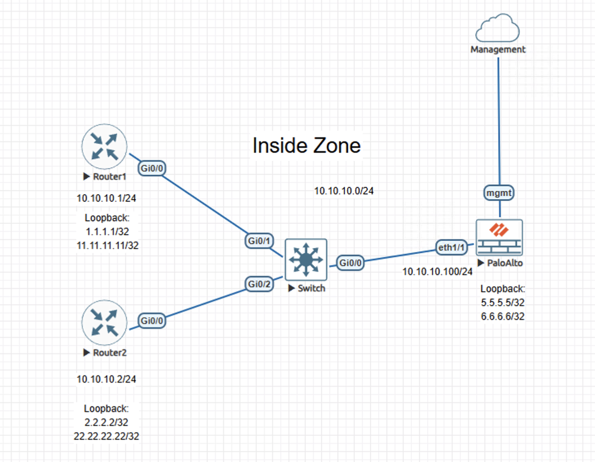
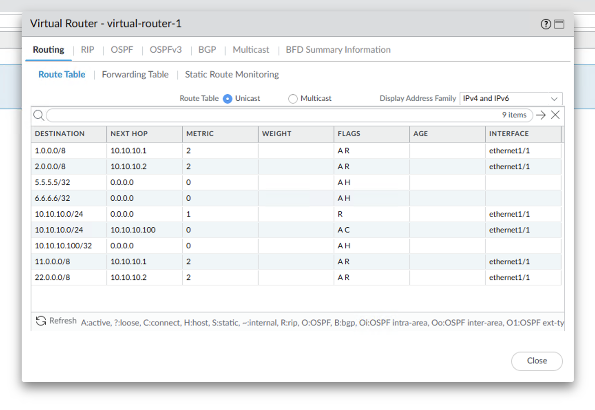
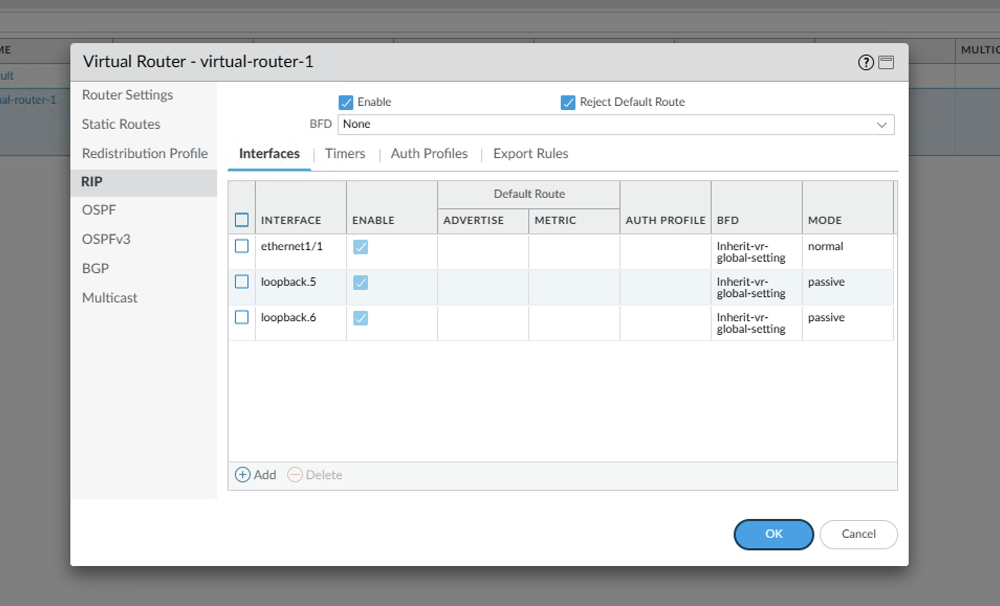

# RIP Routing on Palo Alto NGFW

## Overview
This lab documents the configuration of the RIP dynamic routing protocol between a Palo Alto Networks next-generation firewall and Cisco routers in a shared routing environment. The focus is on dynamic route exchange, protocol behavior, and validation of RIP-learned routes within a firewall-centric topology.

This lab is documented as a validated engineering case note rather than a step-by-step configuration walkthrough.

---

## Lab Objectives
- Enable RIP on a Palo Alto firewall and Cisco routers
- Advertise connected and loopback networks dynamically
- Define active and passive RIP interfaces
- Validate RIP-learned routes on the firewall

---

## Topology Summary
The topology consists of Cisco routers exchanging RIP updates with a Palo Alto Networks firewall on a shared network segment. Loopback interfaces are advertised to validate dynamic route propagation and correct next-hop resolution.

---

## Configuration Summary
- RIP enabled on the Palo Alto firewall virtual router
- RIP enabled on Cisco routers
- Loopback interfaces advertised dynamically
- Active and passive RIP interfaces configured on the firewall

*(Detailed configuration steps are intentionally omitted to emphasize routing behavior and validation outcomes.)*

---

## Validation and Results
- RIP adjacencies formed successfully between all devices
- RIP-learned routes were installed in the Palo Alto firewall routing table
- Correct next-hop resolution observed for dynamically learned routes
- Stable routing behavior verified across the environment

---

## Key Takeaways
- Palo Alto firewalls can participate in legacy dynamic routing protocols
- Dynamic routing validation should focus on routing behavior rather than configuration presence
- Even simple routing protocols require careful interface scoping and control

---

## Lab Environment
- Palo Alto Networks NGFW (VM-Series)
- Cisco IOS routers
- EVE-NG virtual lab platform

---

### ✅ Status
Validated and complete.
