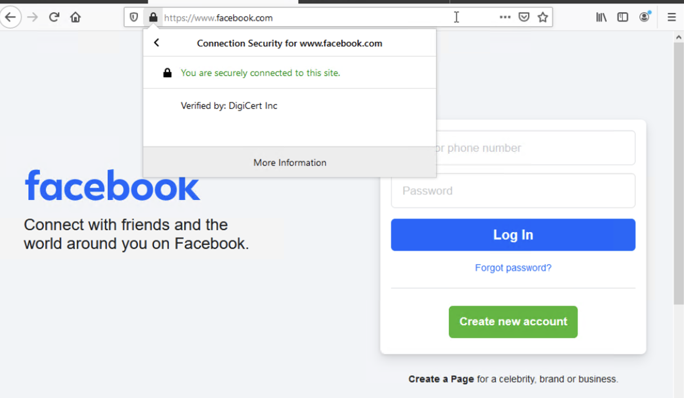
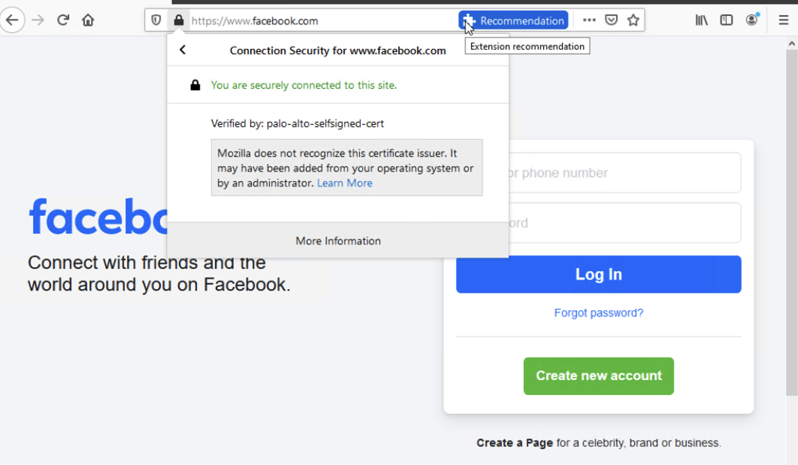

# Lab – SSL Forward Proxy Decryption

## Overview
This lab demonstrates the operational boundary at which a Palo Alto Networks NGFW transitions from forwarding encrypted traffic to actively controlling it by assuming certificate authority responsibility. SSL forward proxy decryption was intentionally configured to enable inspection of HTTPS traffic and enforcement of security policy beyond basic allow or block decisions.

This lab is documented as a validated engineering case note rather than a configuration walkthrough.

## Lab Objectives
- Confirm baseline HTTPS passthrough behavior when encrypted traffic is not inspected
- Validate firewall control over encrypted traffic through certificate authority substitution
- Observe the introduction of client trust dependency as a prerequisite for SSL inspection
- Verify SSL forward proxy operation using client-visible certificate evidence

## Topology Summary
The topology consists of an internal client traversing a Palo Alto Networks NGFW to access external internet services. The firewall operates inline on the dataplane as an SSL forward proxy, while management access remains isolated from production traffic.

## Configuration Summary
- SSL forward proxy decryption enabled
- Firewall-generated certificate authority configured
- Decryption policy applied to outbound HTTPS traffic

(Configuration details intentionally omitted; focus is on behavior and validation.)

## Validation and Results

### Behavior Without the Control
Before SSL forward proxy was enabled, HTTPS traffic traversed the firewall without decryption. The client observed certificates issued by public certificate authorities, confirming that encrypted traffic was forwarded without inspection or certificate substitution.

### Behavior With the Control
After SSL forward proxy decryption was enabled, the firewall assumed certificate authority responsibility and substituted origin server certificates with firewall-issued certificates. This change was directly observable at the client, establishing certificate trust as the gating factor for encrypted traffic inspection.

## Key Takeaways
- SSL forward proxy introduces an explicit control boundary for encrypted traffic
- Certificate authority ownership, not network reachability, determines inspection capability
- Client trust is a required dependency for enforcing security policy on HTTPS traffic

## Lab Environment
- Palo Alto Networks NGFW (VM-Series)
- Client workstation
- EVE-NG virtual lab platform

## Status
Validated and complete.
