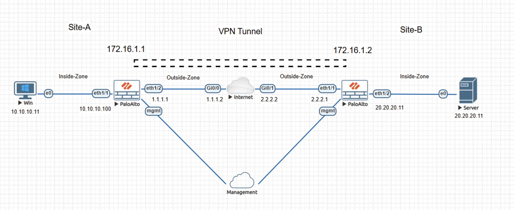
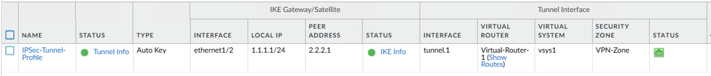
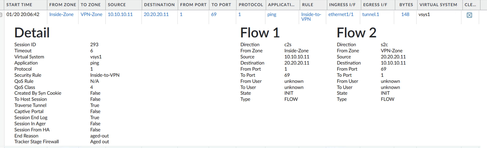
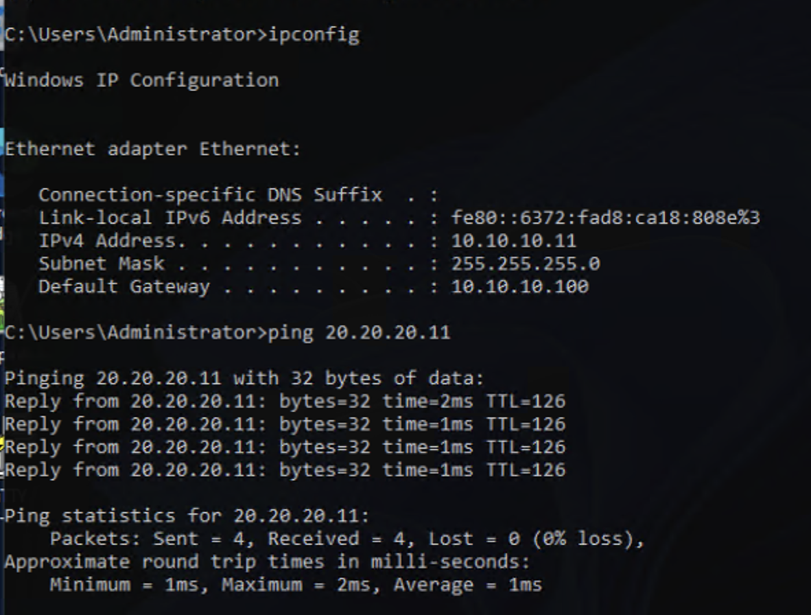

# Lab – Site-to-Site IPsec VPN on Palo Alto NGFW

This lab demonstrates encrypted connectivity between two sites using a Palo Alto NGFW site-to-site IPsec VPN, with inter-site traffic routed through a tunnel interface and enforced by zone-based security policy.

This lab is documented as a validated engineering case note rather than a configuration walkthrough.

## Lab Objectives
- Establish an IPsec site-to-site VPN between two isolated networks
- Confirm IKE and IPsec control-plane operational state
- Validate tunnel-based routing and zone enforcement
- Observe encrypted data-plane traffic traversing the VPN tunnel

## Topology Summary
The lab consists of two sites connected over the internet, each protected by a Palo Alto NGFW. Internal hosts reside in separate trust zones, while a dedicated tunnel interface placed in a VPN security zone provides the sole permitted path for inter-site communication. Management connectivity is isolated from data-plane traffic.

## Configuration Summary
- IKE gateway and IPsec tunnel configuration
- Tunnel interface bound to a VPN security zone
- Static routes directing inter-site traffic to the tunnel interface
- Explicit Inside-to-VPN security policy allowing inter-site traffic

(Configuration details intentionally omitted; focus is on behavior and validation.)

## Validation and Results

### Proof of Operational State
IKE and IPsec security associations are established and active, and the tunnel interface is operational, correctly associated with the virtual router, and placed in the VPN security zone.

### Data-Plane Validation
ICMP traffic from the Site-A internal host to the Site-B server is permitted by policy, routed through the tunnel interface, and observed in traffic logs and session details showing tunnel-based egress, confirming encrypted inter-site communication.

## Key Takeaways
- Tunnel interfaces provide a clear trust boundary for inter-site traffic.
- Zone-based security policy enforces VPN usage rather than relying on implicit routing.
- Encrypted routing paths reduce exposure to unintended cleartext inter-site communication.

## Lab Environment
- Palo Alto NGFW (VM-Series)
- Peer Palo Alto NGFW
- EVE-NG

## Status
Validated and complete.
