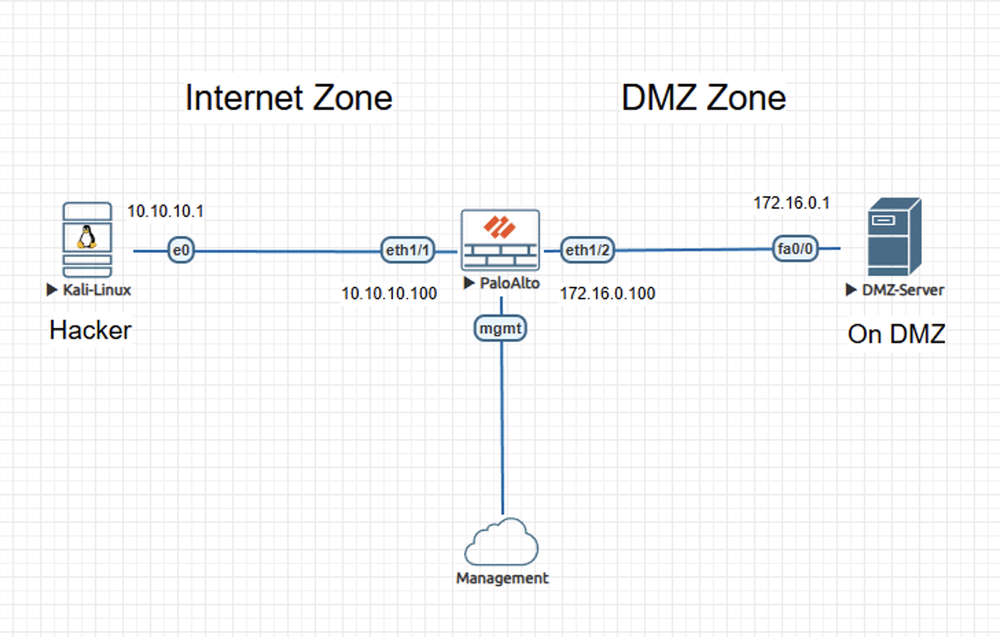
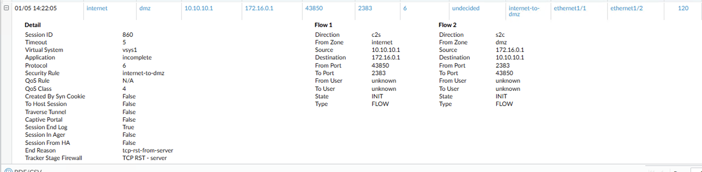
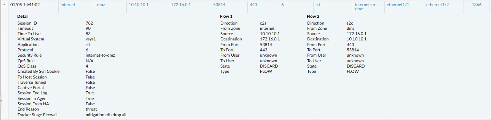

# Lab – Vulnerability Protection Enforcement on Palo Alto NGFW

## Overview
This lab demonstrates how a Palo Alto Networks next-generation firewall enforces vulnerability protection against hostile traffic targeting exposed DMZ services. The focus is on observable session behavior and threat-based enforcement outcomes. 

This lab is documented as a validated engineering case note rather than a configuration walkthrough.

## Lab Objectives
- Confirm baseline DMZ session behavior without vulnerability enforcement
- Observe server-side session termination during unauthenticated scan activity
- Validate detection of malicious traffic once vulnerability protection is enabled
- Verify firewall-enforced session drops through threat and session logs

## Topology Summary
The topology consists of an untrusted internet host simulating an attacker, a Palo Alto Networks NGFW enforcing policy between trust boundaries, and a DMZ server exposing services to the internet. Traffic traverses from the internet zone to the DMZ zone, allowing observation of both baseline and enforced security behavior.

## Configuration Summary
- Security policy permitting internet-to-DMZ traffic
- Vulnerability protection profile applied to the security policy
- Logging enabled for session and threat visibility

(Configuration details intentionally omitted; focus is on behavior and validation.)

## Validation and Results

### Behavior Without the Control
Prior to vulnerability protection enforcement, inbound scan traffic successfully traversed the firewall. Sessions were permitted and terminated by the destination server, evidenced by TCP resets and the absence of threat-based firewall intervention.

### Behavior With the Control
After enabling vulnerability protection, inbound attack traffic was detected inline by the firewall. Sessions were actively discarded by the threat engine, with termination attributed to vulnerability mitigation as shown in threat and session logs.

## Key Takeaways
- Permitting traffic alone does not provide protection against reconnaissance and exploitation attempts
- Vulnerability protection enables the firewall to transition from passive transit to active enforcement
- Threat-based session termination provides clear, auditable security outcomes

## Lab Environment
- Palo Alto Networks NGFW (VM-Series)
- Kali Linux attacker host
- DMZ server
- EVE-NG virtual lab platform

## Status
Validated and complete.
