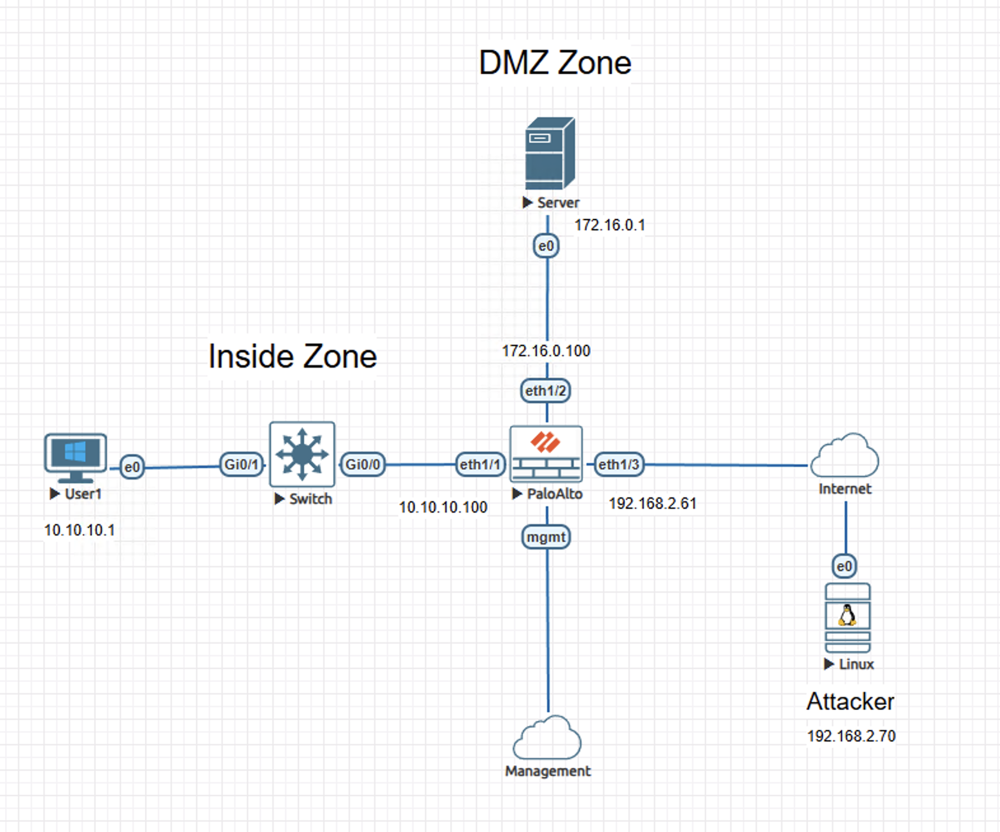
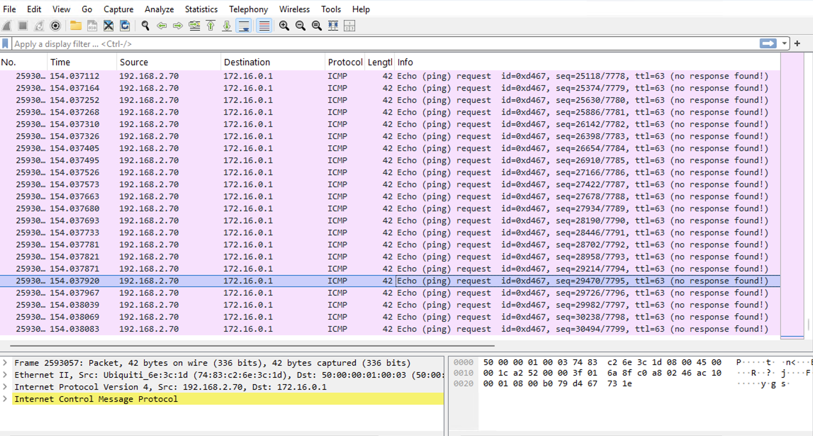
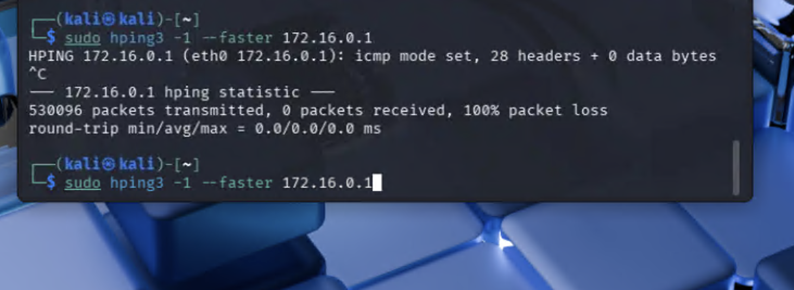

# Lab – Zone and DoS Protection on Palo Alto NGFW

## Overview
This lab demonstrates how Palo Alto NGFW Zone and DoS Protection handle sustained traffic load at exposed trust boundaries. ICMP flood traffic is used as an observable condition to assess enforcement behavior using the firewall's packet capture. 

This lab is documented as a validated engineering case note rather than a configuration walkthrough.

## Lab Objectives
- Observe baseline ICMP traffic behavior prior to protection enforcement
- Confirm Zone and DoS Protection behavior at public-facing and DMZ boundaries
- Verify changes in traffic handling under sustained load using packet-level evidence
- Demonstrate loss of attacker reachability once enforcement occurs

## Topology Summary
The environment consists of an internal network, a DMZ-hosted server, and an external attacker network. A Palo Alto NGFW enforces trust boundaries between inside, DMZ, and untrusted zones. An unauthorized external host generates high-rate ICMP traffic toward a DMZ-exposed service through the public-facing interface.

## Configuration Summary
- Zone Protection Profiles applied to public-facing and DMZ zones
- DoS Protection policies enforcing traffic rate thresholds

(Configuration details intentionally omitted; focus is on behavior and validation.)

## Validation and Results

### Behavior Without the Control
Firewall dataplane packet capture shows ICMP echo requests from the attacker reaching the DMZ server with corresponding echo replies transmitted back through the firewall, confirming unrestricted baseline behavior.

### Behavior With the Control
After flood enforcement engages, dataplane packet capture shows ICMP echo requests arriving at the firewall without corresponding replies being transmitted. The attacker host records complete packet loss, confirming Zone and DoS Protection behavior under sustained load.

## Key Takeaways
- Zone Protection governs traffic handling at exposed trust boundaries
- DoS Protection enforces rate-based controls during sustained traffic conditions
- Packet-level capture provides authoritative evidence of enforcement behavior

## Lab Environment
- Palo Alto Networks NGFW (VM-Series)
- Cisco routing and switching infrastructure
- Linux-based attacker and server hosts
- EVE-NG virtual lab platform

## Status
Validated and complete.
